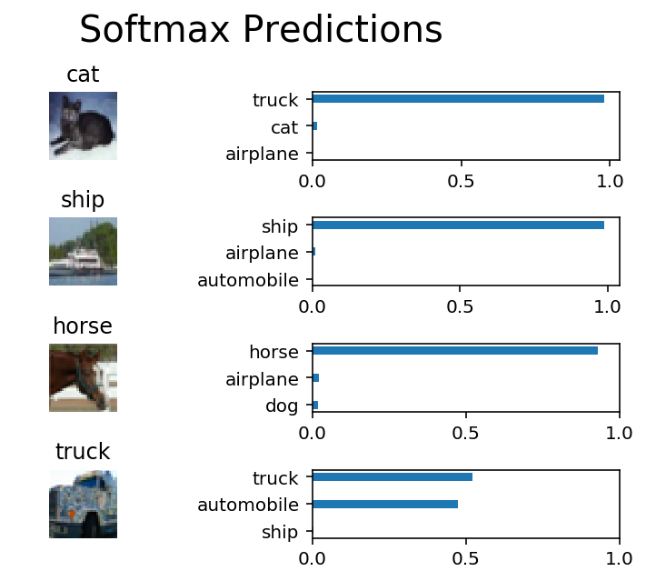

# Image Classification
In this project, you'll classify images from the [CIFAR-10 dataset](https://www.cs.toronto.edu/~kriz/cifar.html).  The dataset consists of airplanes, dogs, cats, and other objects. You'll preprocess the images, then train a convolutional neural network on all the samples. The images need to be normalized and the labels need to be one-hot encoded.  You'll get to apply what you learned and build a convolutional, max pooling, dropout, and fully connected layers.  At the end, you'll get to see your neural network's predictions on the sample images.
## Get the Data
Run the following cell to download the [CIFAR-10 dataset for python](https://www.cs.toronto.edu/~kriz/cifar-10-python.tar.gz).


```python
"""
DON'T MODIFY ANYTHING IN THIS CELL THAT IS BELOW THIS LINE
"""
from urllib.request import urlretrieve
from os.path import isfile, isdir
from tqdm import tqdm
import problem_unittests as tests
import tarfile

cifar10_dataset_folder_path = 'cifar-10-batches-py'

# Use Floyd's cifar-10 dataset if present
floyd_cifar10_location = '/cifar/cifar-10-python.tar.gz'
if isfile(floyd_cifar10_location):
    tar_gz_path = floyd_cifar10_location
else:
    tar_gz_path = 'cifar-10-python.tar.gz'

class DLProgress(tqdm):
    last_block = 0

    def hook(self, block_num=1, block_size=1, total_size=None):
        self.total = total_size
        self.update((block_num - self.last_block) * block_size)
        self.last_block = block_num

if not isfile(tar_gz_path):
    with DLProgress(unit='B', unit_scale=True, miniters=1, desc='CIFAR-10 Dataset') as pbar:
        urlretrieve(
            'https://www.cs.toronto.edu/~kriz/cifar-10-python.tar.gz',
            tar_gz_path,
            pbar.hook)

if not isdir(cifar10_dataset_folder_path):
    with tarfile.open(tar_gz_path) as tar:
        tar.extractall()
        tar.close()


tests.test_folder_path(cifar10_dataset_folder_path)
```

    CIFAR-10 Dataset: 171MB [04:51, 585KB/s]                               


    All files found!


## Explore the Data
The dataset is broken into batches to prevent your machine from running out of memory.  The CIFAR-10 dataset consists of 5 batches, named `data_batch_1`, `data_batch_2`, etc.. Each batch contains the labels and images that are one of the following:
* airplane
* automobile
* bird
* cat
* deer
* dog
* frog
* horse
* ship
* truck

Understanding a dataset is part of making predictions on the data.  Play around with the code cell below by changing the `batch_id` and `sample_id`. The `batch_id` is the id for a batch (1-5). The `sample_id` is the id for a image and label pair in the batch.

Ask yourself "What are all possible labels?", "What is the range of values for the image data?", "Are the labels in order or random?".  Answers to questions like these will help you preprocess the data and end up with better predictions.


```python
%matplotlib inline
%config InlineBackend.figure_format = 'retina'

import helper
import numpy as np

# Explore the dataset
batch_id = 1
sample_id = 5
helper.display_stats(cifar10_dataset_folder_path, batch_id, sample_id)
```

    
    Stats of batch 1:
    Samples: 10000
    Label Counts: {0: 1005, 1: 974, 2: 1032, 3: 1016, 4: 999, 5: 937, 6: 1030, 7: 1001, 8: 1025, 9: 981}
    First 20 Labels: [6, 9, 9, 4, 1, 1, 2, 7, 8, 3, 4, 7, 7, 2, 9, 9, 9, 3, 2, 6]
    
    Example of Image 5:
    Image - Min Value: 0 Max Value: 252
    Image - Shape: (32, 32, 3)
    Label - Label Id: 1 Name: automobile


## Implement Preprocess Functions
### Normalize
In the cell below, implement the `normalize` function to take in image data, `x`, and return it as a normalized Numpy array. The values should be in the range of 0 to 1, inclusive.  The return object should be the same shape as `x`.


	


```python
def normalize(x):
    """
    Normalize a list of sample image data in the range of 0 to 1
    : x: List of image data.  The image shape is (32, 32, 3)
    : return: Numpy array of normalize data
    """
    x_min = x.min(axis=(0, 1), keepdims=True)
    x_max = x.max(axis=(0, 1), keepdims=True)
    x_normalized =(x - x_min)/(x_max - x_min)
    return x_normalized


"""
DON'T MODIFY ANYTHING IN THIS CELL THAT IS BELOW THIS LINE
"""
tests.test_normalize(normalize)
```

    Tests Passed


### One-hot encode
Just like the previous code cell, you'll be implementing a function for preprocessing.  This time, you'll implement the `one_hot_encode` function. The input, `x`, are a list of labels.  Implement the function to return the list of labels as One-Hot encoded Numpy array.  The possible values for labels are 0 to 9. The one-hot encoding function should return the same encoding for each value between each call to `one_hot_encode`.  Make sure to save the map of encodings outside the function.

Hint: Don't reinvent the wheel.


```python
def one_hot_encode(x):
    """
    One hot encode a list of sample labels. Return a one-hot encoded vector for each label.
    : x: List of sample Labels
    : return: Numpy array of one-hot encoded labels
    """
    from sklearn.preprocessing import OneHotEncoder
    enc = OneHotEncoder()
    enc.fit(np.asarray(([list(range(10))])).T)
    return enc.transform(np.asarray([x]).T).toarray()


"""
DON'T MODIFY ANYTHING IN THIS CELL THAT IS BELOW THIS LINE
"""
tests.test_one_hot_encode(one_hot_encode)
```

    Tests Passed


### Randomize Data
As you saw from exploring the data above, the order of the samples are randomized.  It doesn't hurt to randomize it again, but you don't need to for this dataset.

## Preprocess all the data and save it
Running the code cell below will preprocess all the CIFAR-10 data and save it to file. The code below also uses 10% of the training data for validation.


```python
"""
DON'T MODIFY ANYTHING IN THIS CELL
"""
# Preprocess Training, Validation, and Testing Data
helper.preprocess_and_save_data(cifar10_dataset_folder_path, normalize, one_hot_encode)
```

# Check Point
This is your first checkpoint.  If you ever decide to come back to this notebook or have to restart the notebook, you can start from here.  The preprocessed data has been saved to disk.


```python
"""
DON'T MODIFY ANYTHING IN THIS CELL
"""
import pickle
import problem_unittests as tests
import helper

# Load the Preprocessed Validation data
valid_features, valid_labels = pickle.load(open('preprocess_validation.p', mode='rb'))
```

## Build the network
For the neural network, you'll build each layer into a function.  Most of the code you've seen has been outside of functions. To test your code more thoroughly, we require that you put each layer in a function.  This allows us to give you better feedback and test for simple mistakes using our unittests before you submit your project.

>**Note:** If you're finding it hard to dedicate enough time for this course each week, we've provided a small shortcut to this part of the project. In the next couple of problems, you'll have the option to use classes from the [TensorFlow Layers](https://www.tensorflow.org/api_docs/python/tf/layers) or [TensorFlow Layers (contrib)](https://www.tensorflow.org/api_guides/python/contrib.layers) packages to build each layer, except the layers you build in the "Convolutional and Max Pooling Layer" section.  TF Layers is similar to Keras's and TFLearn's abstraction to layers, so it's easy to pickup.

>However, if you would like to get the most out of this course, try to solve all the problems _without_ using anything from the TF Layers packages. You **can** still use classes from other packages that happen to have the same name as ones you find in TF Layers! For example, instead of using the TF Layers version of the `conv2d` class, [tf.layers.conv2d](https://www.tensorflow.org/api_docs/python/tf/layers/conv2d), you would want to use the TF Neural Network version of `conv2d`, [tf.nn.conv2d](https://www.tensorflow.org/api_docs/python/tf/nn/conv2d). 

Let's begin!

### Input
The neural network needs to read the image data, one-hot encoded labels, and dropout keep probability. Implement the following functions
* Implement `neural_net_image_input`
 * Return a [TF Placeholder](https://www.tensorflow.org/api_docs/python/tf/placeholder)
 * Set the shape using `image_shape` with batch size set to `None`.
 * Name the TensorFlow placeholder "x" using the TensorFlow `name` parameter in the [TF Placeholder](https://www.tensorflow.org/api_docs/python/tf/placeholder).
* Implement `neural_net_label_input`
 * Return a [TF Placeholder](https://www.tensorflow.org/api_docs/python/tf/placeholder)
 * Set the shape using `n_classes` with batch size set to `None`.
 * Name the TensorFlow placeholder "y" using the TensorFlow `name` parameter in the [TF Placeholder](https://www.tensorflow.org/api_docs/python/tf/placeholder).
* Implement `neural_net_keep_prob_input`
 * Return a [TF Placeholder](https://www.tensorflow.org/api_docs/python/tf/placeholder) for dropout keep probability.
 * Name the TensorFlow placeholder "keep_prob" using the TensorFlow `name` parameter in the [TF Placeholder](https://www.tensorflow.org/api_docs/python/tf/placeholder).

These names will be used at the end of the project to load your saved model.

Note: `None` for shapes in TensorFlow allow for a dynamic size.


```python
import tensorflow as tf

def neural_net_image_input(image_shape):
    """
    Return a Tensor for a batch of image input
    : image_shape: Shape of the images
    : return: Tensor for image input.
    """
    #Implement Function
       
    return tf.placeholder(tf.float32, shape=((None,) + image_shape), name='x')


def neural_net_label_input(n_classes):
    """
    Return a Tensor for a batch of label input
    : n_classes: Number of classes
    : return: Tensor for label input.
    """
    # Implement Function
    return tf.placeholder(tf.float32, shape=(None, n_classes), name='y')


def neural_net_keep_prob_input():
    """
    Return a Tensor for keep probability
    : return: Tensor for keep probability.
    """
    # Implement Function
    return  tf.placeholder(tf.float32, name='keep_prob')


"""
DON'T MODIFY ANYTHING IN THIS CELL THAT IS BELOW THIS LINE
"""
tf.reset_default_graph()
tests.test_nn_image_inputs(neural_net_image_input)
tests.test_nn_label_inputs(neural_net_label_input)
tests.test_nn_keep_prob_inputs(neural_net_keep_prob_input)
```

    Image Input Tests Passed.
    Label Input Tests Passed.
    Keep Prob Tests Passed.


### Convolution and Max Pooling Layer
Convolution layers have a lot of success with images. For this code cell, you should implement the function `conv2d_maxpool` to apply convolution then max pooling:
* Create the weight and bias using `conv_ksize`, `conv_num_outputs` and the shape of `x_tensor`.
* Apply a convolution to `x_tensor` using weight and `conv_strides`.
 * We recommend you use same padding, but you're welcome to use any padding.
* Add bias
* Add a nonlinear activation to the convolution.
* Apply Max Pooling using `pool_ksize` and `pool_strides`.
 * We recommend you use same padding, but you're welcome to use any padding.

**Note:** You **can't** use [TensorFlow Layers](https://www.tensorflow.org/api_docs/python/tf/layers) or [TensorFlow Layers (contrib)](https://www.tensorflow.org/api_guides/python/contrib.layers) for **this** layer, but you can still use TensorFlow's [Neural Network](https://www.tensorflow.org/api_docs/python/tf/nn) package. You may still use the shortcut option for all the **other** layers.


```python
def conv2d_maxpool(x_tensor, conv_num_outputs, conv_ksize, conv_strides, pool_ksize, pool_strides):
    """
    Apply convolution then max pooling to x_tensor
    :param x_tensor: TensorFlow Tensor
    :param conv_num_outputs: Number of outputs for the convolutional layer
    :param conv_ksize: kernal size 2-D Tuple for the convolutional layer
    :param conv_strides: Stride 2-D Tuple for convolution
    :param pool_ksize: kernal size 2-D Tuple for pool
    :param pool_strides: Stride 2-D Tuple for pool
    : return: A tensor that represents convolution and max pooling of x_tensor
    """
    # Implement Function
   
    weights_shape =  [conv_ksize[0], conv_ksize[1], int(x_tensor.get_shape()[3]), conv_num_outputs]
    weights = tf.Variable(tf.truncated_normal(weights_shape, stddev=5e-2))
    bias = tf.Variable(tf.zeros(conv_num_outputs))
    conv = tf.nn.conv2d(x_tensor, weights, [1, conv_strides[0], conv_strides[1], 1], padding='SAME', name='conv')


    pre_activation = tf.nn.bias_add(conv, bias)
    conv1 = tf.nn.relu(pre_activation, name='conv1')
    pool1 = tf.nn.max_pool(conv1, [1, pool_ksize[0], pool_ksize[1], 1], [1, pool_strides[0],
                                                                         pool_strides[1], 1], padding='SAME', name='pool1')

    
    return pool1 


"""
DON'T MODIFY ANYTHING IN THIS CELL THAT IS BELOW THIS LINE
"""
tests.test_con_pool(conv2d_maxpool)
```

    Tests Passed


### Flatten Layer
Implement the `flatten` function to change the dimension of `x_tensor` from a 4-D tensor to a 2-D tensor.  The output should be the shape (*Batch Size*, *Flattened Image Size*). Shortcut option: you can use classes from the [TensorFlow Layers](https://www.tensorflow.org/api_docs/python/tf/layers) or [TensorFlow Layers (contrib)](https://www.tensorflow.org/api_guides/python/contrib.layers) packages for this layer. For more of a challenge, only use other TensorFlow packages.


```python
def flatten(x_tensor):
    """
    Flatten x_tensor to (Batch Size, Flattened Image Size)
    : x_tensor: A tensor of size (Batch Size, ...), where ... are the image dimensions.
    : return: A tensor of size (Batch Size, Flattened Image Size).
    """

    fs = np.array(x_tensor.get_shape().as_list()[1:]).prod()
    
    return tf.reshape(x_tensor, [tf.shape(x_tensor)[0], fs])


"""
DON'T MODIFY ANYTHING IN THIS CELL THAT IS BELOW THIS LINE
"""
tests.test_flatten(flatten)
```

    Tests Passed


### Fully-Connected Layer
Implement the `fully_conn` function to apply a fully connected layer to `x_tensor` with the shape (*Batch Size*, *num_outputs*). Shortcut option: you can use classes from the [TensorFlow Layers](https://www.tensorflow.org/api_docs/python/tf/layers) or [TensorFlow Layers (contrib)](https://www.tensorflow.org/api_guides/python/contrib.layers) packages for this layer. For more of a challenge, only use other TensorFlow packages.


```python
def fully_conn(x_tensor, num_outputs):
    """
    Apply a fully connected layer to x_tensor using weight and bias
    : x_tensor: A 2-D tensor where the first dimension is batch size.
    : num_outputs: The number of output that the new tensor should be.
    : return: A 2-D tensor where the second dimension is num_outputs.
    """

    fs = np.array(x_tensor.get_shape().as_list()[1:]).prod()
    bias = tf.Variable(tf.zeros(num_outputs))

    weights = tf.Variable(tf.truncated_normal([fs, num_outputs], stddev=5e-2))
    fc = tf.nn.relu(tf.matmul(x_tensor, weights) + bias, name='FC')
    
    return fc


"""
DON'T MODIFY ANYTHING IN THIS CELL THAT IS BELOW THIS LINE
"""
tests.test_fully_conn(fully_conn)
```

    Tests Passed


### Output Layer
Implement the `output` function to apply a fully connected layer to `x_tensor` with the shape (*Batch Size*, *num_outputs*). Shortcut option: you can use classes from the [TensorFlow Layers](https://www.tensorflow.org/api_docs/python/tf/layers) or [TensorFlow Layers (contrib)](https://www.tensorflow.org/api_guides/python/contrib.layers) packages for this layer. For more of a challenge, only use other TensorFlow packages.

**Note:** Activation, softmax, or cross entropy should **not** be applied to this.


```python
def output(x_tensor, num_outputs):
    """
    Apply a output layer to x_tensor using weight and bias
    : x_tensor: A 2-D tensor where the first dimension is batch size.
    : num_outputs: The number of output that the new tensor should be.
    : return: A 2-D tensor where the second dimension is num_outputs.
    """
    fs = np.array(x_tensor.get_shape().as_list()[1:]).prod()
    bias = tf.Variable(tf.zeros(num_outputs))

    weights = tf.Variable(tf.truncated_normal([fs, num_outputs], stddev=5e-2))
    #output = tf.nn.relu(tf.matmul(x_tensor, weights) + bias, name='output')
    output = tf.add(tf.matmul(x_tensor, weights), bias)
    
    return output


"""
DON'T MODIFY ANYTHING IN THIS CELL THAT IS BELOW THIS LINE
"""
tests.test_output(output)
```

    Tests Passed


### Create Convolutional Model
Implement the function `conv_net` to create a convolutional neural network model. The function takes in a batch of images, `x`, and outputs logits.  Use the layers you created above to create this model:

* Apply 1, 2, or 3 Convolution and Max Pool layers
* Apply a Flatten Layer
* Apply 1, 2, or 3 Fully Connected Layers
* Apply an Output Layer
* Return the output
* Apply [TensorFlow's Dropout](https://www.tensorflow.org/api_docs/python/tf/nn/dropout) to one or more layers in the model using `keep_prob`. 


```python
def conv_net(x, keep_prob):
    """
    Create a convolutional neural network model
    : x: Placeholder tensor that holds image data.
    : keep_prob: Placeholder tensor that hold dropout keep probability.
    : return: Tensor that represents logits
    """
    # TODO: Apply 1, 2, or 3 Convolution and Max Pool layers
    #    Play around with different number of outputs, kernel size and stride
    # Function Definition from Above:
    conv = conv2d_maxpool(x,
                           conv_num_outputs=62,
                           conv_ksize=[6,6],
                           conv_strides=[2,2],
                           pool_ksize=[2,2],
                           pool_strides=[2,2])
    conv = conv2d_maxpool(conv,
                           conv_num_outputs=30,
                           conv_ksize=[3,3],
                           conv_strides=[1,1],
                           pool_ksize=[2,2],
                           pool_strides=[1,1])

    # Apply a Flatten Layer
    # Function Definition from Above:
    flatten_conv = flatten(conv)
    

    # TODO: Apply 1, 2, or 3 Fully Connected Layers
    #    Play around with different number of outputs
    # Function Definition from Above:
    fc =  fully_conn(flatten_conv, 200)
    fc =  fully_conn(flatten_conv, 100)
    fc =  fully_conn(fc, 10)
    
    dropout = tf.nn.dropout(fc, keep_prob)
    # TODO: Apply an Output Layer
    
    
    # TODO: return output
    return output(dropout, 10)  


"""
DON'T MODIFY ANYTHING IN THIS CELL THAT IS BELOW THIS LINE
"""

##############################
## Build the Neural Network ##
##############################

# Remove previous weights, bias, inputs, etc..
tf.reset_default_graph()

# Inputs
x = neural_net_image_input((32, 32, 3))
y = neural_net_label_input(10)
keep_prob = neural_net_keep_prob_input()

# Model
logits = conv_net(x, keep_prob)

# Name logits Tensor, so that is can be loaded from disk after training
logits = tf.identity(logits, name='logits')

# Loss and Optimizer
cost = tf.reduce_mean(tf.nn.softmax_cross_entropy_with_logits(logits=logits, labels=y))
optimizer = tf.train.AdamOptimizer().minimize(cost)

# Accuracy
correct_pred = tf.equal(tf.argmax(logits, 1), tf.argmax(y, 1))
accuracy = tf.reduce_mean(tf.cast(correct_pred, tf.float32), name='accuracy')

tests.test_conv_net(conv_net)
```

    Neural Network Built!


## Train the Neural Network
### Single Optimization
Implement the function `train_neural_network` to do a single optimization.  The optimization should use `optimizer` to optimize in `session` with a `feed_dict` of the following:
* `x` for image input
* `y` for labels
* `keep_prob` for keep probability for dropout

This function will be called for each batch, so `tf.global_variables_initializer()` has already been called.

Note: Nothing needs to be returned. This function is only optimizing the neural network.


```python
def train_neural_network(session, optimizer, keep_probability, feature_batch, label_batch):
    """
    Optimize the session on a batch of images and labels
    : session: Current TensorFlow session
    : optimizer: TensorFlow optimizer function
    : keep_probability: keep probability
    : feature_batch: Batch of Numpy image data
    : label_batch: Batch of Numpy label data
    """
    # Implement Function
    session.run(optimizer, feed_dict={x: feature_batch,
                                      y: label_batch,
                                      keep_prob: keep_probability})


"""
DON'T MODIFY ANYTHING IN THIS CELL THAT IS BELOW THIS LINE
"""
tests.test_train_nn(train_neural_network)
```

    Tests Passed


### Show Stats
Implement the function `print_stats` to print loss and validation accuracy.  Use the global variables `valid_features` and `valid_labels` to calculate validation accuracy.  Use a keep probability of `1.0` to calculate the loss and validation accuracy.


```python
def print_stats(session, feature_batch, label_batch, cost, accuracy):
    """
    Print information about loss and validation accuracy
    : session: Current TensorFlow session
    : feature_batch: Batch of Numpy image data
    : label_batch: Batch of Numpy label data
    : cost: TensorFlow cost function
    : accuracy: TensorFlow accuracy function
    """
    # Implement Function
    loss = sess.run(cost, feed_dict={x: feature_batch,
                                     y: label_batch,
                                     keep_prob: 1.})
    valid_acc = sess.run(accuracy, feed_dict={x: valid_features,
                                              y: valid_labels,
                                              keep_prob: 1.})
    print('Loss: {:>10.5f} Validation Accuracy: {:.5f}'.format(loss, valid_acc))
```

### Hyperparameters
Tune the following parameters:
* Set `epochs` to the number of iterations until the network stops learning or start overfitting
* Set `batch_size` to the highest number that your machine has memory for.  Most people set them to common sizes of memory:
 * 64
 * 128
 * 256
 * ...
* Set `keep_probability` to the probability of keeping a node using dropout


```python
# Tune Parameters
epochs = 99
batch_size = 256
keep_probability = 0.7
```

### Train on a Single CIFAR-10 Batch
Instead of training the neural network on all the CIFAR-10 batches of data, let's use a single batch. This should save time while you iterate on the model to get a better accuracy.  Once the final validation accuracy is 50% or greater, run the model on all the data in the next section.


```python
"""
DON'T MODIFY ANYTHING IN THIS CELL
"""
print('Checking the Training on a Single Batch...')
with tf.Session() as sess:
    # Initializing the variables
    sess.run(tf.global_variables_initializer())
    
    # Training cycle
    for epoch in range(epochs):
        batch_i = 1
        for batch_features, batch_labels in helper.load_preprocess_training_batch(batch_i, batch_size):
            train_neural_network(sess, optimizer, keep_probability, batch_features, batch_labels)
        print('Epoch {:>2}, CIFAR-10 Batch {}:  '.format(epoch + 1, batch_i), end='')
        print_stats(sess, batch_features, batch_labels, cost, accuracy)
```

    Checking the Training on a Single Batch...
    Epoch  1, CIFAR-10 Batch 1:  Loss:    2.27064 Validation Accuracy: 0.17640
    Epoch  2, CIFAR-10 Batch 1:  Loss:    2.23045 Validation Accuracy: 0.22820
    Epoch  3, CIFAR-10 Batch 1:  Loss:    2.22578 Validation Accuracy: 0.24300
    Epoch  4, CIFAR-10 Batch 1:  Loss:    2.10255 Validation Accuracy: 0.31740
    Epoch  5, CIFAR-10 Batch 1:  Loss:    2.02011 Validation Accuracy: 0.31880
    Epoch  6, CIFAR-10 Batch 1:  Loss:    1.97365 Validation Accuracy: 0.32900
    Epoch  7, CIFAR-10 Batch 1:  Loss:    1.89904 Validation Accuracy: 0.36640
    Epoch  8, CIFAR-10 Batch 1:  Loss:    1.84274 Validation Accuracy: 0.33900
    Epoch  9, CIFAR-10 Batch 1:  Loss:    1.92256 Validation Accuracy: 0.33140
    Epoch 10, CIFAR-10 Batch 1:  Loss:    1.82791 Validation Accuracy: 0.36220
    Epoch 11, CIFAR-10 Batch 1:  Loss:    1.72810 Validation Accuracy: 0.39620
    Epoch 12, CIFAR-10 Batch 1:  Loss:    1.70344 Validation Accuracy: 0.39960
    Epoch 13, CIFAR-10 Batch 1:  Loss:    1.67019 Validation Accuracy: 0.40820
    Epoch 14, CIFAR-10 Batch 1:  Loss:    1.63951 Validation Accuracy: 0.39300
    Epoch 15, CIFAR-10 Batch 1:  Loss:    1.58210 Validation Accuracy: 0.40000
    Epoch 16, CIFAR-10 Batch 1:  Loss:    1.54914 Validation Accuracy: 0.43460
    Epoch 17, CIFAR-10 Batch 1:  Loss:    1.55402 Validation Accuracy: 0.40840
    Epoch 18, CIFAR-10 Batch 1:  Loss:    1.43120 Validation Accuracy: 0.43220
    Epoch 19, CIFAR-10 Batch 1:  Loss:    1.44963 Validation Accuracy: 0.42880
    Epoch 20, CIFAR-10 Batch 1:  Loss:    1.39068 Validation Accuracy: 0.45340
    Epoch 21, CIFAR-10 Batch 1:  Loss:    1.31091 Validation Accuracy: 0.45700
    Epoch 22, CIFAR-10 Batch 1:  Loss:    1.32883 Validation Accuracy: 0.43400
    Epoch 23, CIFAR-10 Batch 1:  Loss:    1.25173 Validation Accuracy: 0.45540
    Epoch 24, CIFAR-10 Batch 1:  Loss:    1.25037 Validation Accuracy: 0.45760
    Epoch 25, CIFAR-10 Batch 1:  Loss:    1.19727 Validation Accuracy: 0.47220
    Epoch 26, CIFAR-10 Batch 1:  Loss:    1.14391 Validation Accuracy: 0.47660
    Epoch 27, CIFAR-10 Batch 1:  Loss:    1.21131 Validation Accuracy: 0.46340
    Epoch 28, CIFAR-10 Batch 1:  Loss:    1.13447 Validation Accuracy: 0.48300
    Epoch 29, CIFAR-10 Batch 1:  Loss:    1.08027 Validation Accuracy: 0.48700
    Epoch 30, CIFAR-10 Batch 1:  Loss:    1.07208 Validation Accuracy: 0.49180
    Epoch 31, CIFAR-10 Batch 1:  Loss:    1.03867 Validation Accuracy: 0.48740
    Epoch 32, CIFAR-10 Batch 1:  Loss:    0.97757 Validation Accuracy: 0.49280
    Epoch 33, CIFAR-10 Batch 1:  Loss:    1.05285 Validation Accuracy: 0.49560
    Epoch 34, CIFAR-10 Batch 1:  Loss:    0.96121 Validation Accuracy: 0.50080
    Epoch 35, CIFAR-10 Batch 1:  Loss:    0.95607 Validation Accuracy: 0.48420
    Epoch 36, CIFAR-10 Batch 1:  Loss:    1.09784 Validation Accuracy: 0.48460
    Epoch 37, CIFAR-10 Batch 1:  Loss:    0.93627 Validation Accuracy: 0.48640
    Epoch 38, CIFAR-10 Batch 1:  Loss:    0.84935 Validation Accuracy: 0.49340
    Epoch 39, CIFAR-10 Batch 1:  Loss:    0.86684 Validation Accuracy: 0.48240
    Epoch 40, CIFAR-10 Batch 1:  Loss:    0.85548 Validation Accuracy: 0.49180
    Epoch 41, CIFAR-10 Batch 1:  Loss:    0.81588 Validation Accuracy: 0.50500
    Epoch 42, CIFAR-10 Batch 1:  Loss:    0.74401 Validation Accuracy: 0.51180
    Epoch 43, CIFAR-10 Batch 1:  Loss:    0.70658 Validation Accuracy: 0.50400
    Epoch 44, CIFAR-10 Batch 1:  Loss:    0.71091 Validation Accuracy: 0.50100
    Epoch 45, CIFAR-10 Batch 1:  Loss:    0.73985 Validation Accuracy: 0.50700
    Epoch 46, CIFAR-10 Batch 1:  Loss:    0.71733 Validation Accuracy: 0.50140
    Epoch 47, CIFAR-10 Batch 1:  Loss:    0.66489 Validation Accuracy: 0.50720
    Epoch 48, CIFAR-10 Batch 1:  Loss:    0.62442 Validation Accuracy: 0.51260
    Epoch 49, CIFAR-10 Batch 1:  Loss:    0.63732 Validation Accuracy: 0.51560
    Epoch 50, CIFAR-10 Batch 1:  Loss:    0.63668 Validation Accuracy: 0.50620
    Epoch 51, CIFAR-10 Batch 1:  Loss:    0.61797 Validation Accuracy: 0.51460
    Epoch 52, CIFAR-10 Batch 1:  Loss:    0.60897 Validation Accuracy: 0.53260
    Epoch 53, CIFAR-10 Batch 1:  Loss:    0.56400 Validation Accuracy: 0.52760
    Epoch 54, CIFAR-10 Batch 1:  Loss:    0.56366 Validation Accuracy: 0.52300
    Epoch 55, CIFAR-10 Batch 1:  Loss:    0.55967 Validation Accuracy: 0.52160
    Epoch 56, CIFAR-10 Batch 1:  Loss:    0.56609 Validation Accuracy: 0.51260
    Epoch 57, CIFAR-10 Batch 1:  Loss:    0.56027 Validation Accuracy: 0.52300
    Epoch 58, CIFAR-10 Batch 1:  Loss:    0.51335 Validation Accuracy: 0.52340
    Epoch 59, CIFAR-10 Batch 1:  Loss:    0.56223 Validation Accuracy: 0.49520
    Epoch 60, CIFAR-10 Batch 1:  Loss:    0.56354 Validation Accuracy: 0.51520
    Epoch 61, CIFAR-10 Batch 1:  Loss:    0.47802 Validation Accuracy: 0.52860
    Epoch 62, CIFAR-10 Batch 1:  Loss:    0.46724 Validation Accuracy: 0.53100
    Epoch 63, CIFAR-10 Batch 1:  Loss:    0.47327 Validation Accuracy: 0.52940
    Epoch 64, CIFAR-10 Batch 1:  Loss:    0.45593 Validation Accuracy: 0.53300
    Epoch 65, CIFAR-10 Batch 1:  Loss:    0.46491 Validation Accuracy: 0.51140
    Epoch 66, CIFAR-10 Batch 1:  Loss:    0.43197 Validation Accuracy: 0.53220
    Epoch 67, CIFAR-10 Batch 1:  Loss:    0.46353 Validation Accuracy: 0.53620
    Epoch 68, CIFAR-10 Batch 1:  Loss:    0.41344 Validation Accuracy: 0.52720
    Epoch 69, CIFAR-10 Batch 1:  Loss:    0.48382 Validation Accuracy: 0.52160
    Epoch 70, CIFAR-10 Batch 1:  Loss:    0.51627 Validation Accuracy: 0.50000
    Epoch 71, CIFAR-10 Batch 1:  Loss:    0.48496 Validation Accuracy: 0.49500
    Epoch 72, CIFAR-10 Batch 1:  Loss:    0.44693 Validation Accuracy: 0.52080
    Epoch 73, CIFAR-10 Batch 1:  Loss:    0.42462 Validation Accuracy: 0.51840
    Epoch 74, CIFAR-10 Batch 1:  Loss:    0.41986 Validation Accuracy: 0.51880
    Epoch 75, CIFAR-10 Batch 1:  Loss:    0.40085 Validation Accuracy: 0.52440
    Epoch 76, CIFAR-10 Batch 1:  Loss:    0.40449 Validation Accuracy: 0.52920
    Epoch 77, CIFAR-10 Batch 1:  Loss:    0.35862 Validation Accuracy: 0.52220
    Epoch 78, CIFAR-10 Batch 1:  Loss:    0.36480 Validation Accuracy: 0.52820
    Epoch 79, CIFAR-10 Batch 1:  Loss:    0.32764 Validation Accuracy: 0.54720
    Epoch 80, CIFAR-10 Batch 1:  Loss:    0.30732 Validation Accuracy: 0.54300
    Epoch 81, CIFAR-10 Batch 1:  Loss:    0.29080 Validation Accuracy: 0.55760
    Epoch 82, CIFAR-10 Batch 1:  Loss:    0.32116 Validation Accuracy: 0.54800
    Epoch 83, CIFAR-10 Batch 1:  Loss:    0.30821 Validation Accuracy: 0.54840
    Epoch 84, CIFAR-10 Batch 1:  Loss:    0.30586 Validation Accuracy: 0.53940
    Epoch 85, CIFAR-10 Batch 1:  Loss:    0.30712 Validation Accuracy: 0.53860
    Epoch 86, CIFAR-10 Batch 1:  Loss:    0.35271 Validation Accuracy: 0.52420
    Epoch 87, CIFAR-10 Batch 1:  Loss:    0.34757 Validation Accuracy: 0.53020
    Epoch 88, CIFAR-10 Batch 1:  Loss:    0.31779 Validation Accuracy: 0.54980
    Epoch 89, CIFAR-10 Batch 1:  Loss:    0.30486 Validation Accuracy: 0.53940
    Epoch 90, CIFAR-10 Batch 1:  Loss:    0.27284 Validation Accuracy: 0.52800
    Epoch 91, CIFAR-10 Batch 1:  Loss:    0.29530 Validation Accuracy: 0.53940
    Epoch 92, CIFAR-10 Batch 1:  Loss:    0.25722 Validation Accuracy: 0.53600
    Epoch 93, CIFAR-10 Batch 1:  Loss:    0.24684 Validation Accuracy: 0.54780
    Epoch 94, CIFAR-10 Batch 1:  Loss:    0.27050 Validation Accuracy: 0.53660
    Epoch 95, CIFAR-10 Batch 1:  Loss:    0.27601 Validation Accuracy: 0.54300
    Epoch 96, CIFAR-10 Batch 1:  Loss:    0.25122 Validation Accuracy: 0.54180
    Epoch 97, CIFAR-10 Batch 1:  Loss:    0.23734 Validation Accuracy: 0.53740
    Epoch 98, CIFAR-10 Batch 1:  Loss:    0.30342 Validation Accuracy: 0.51520
    Epoch 99, CIFAR-10 Batch 1:  Loss:    0.32643 Validation Accuracy: 0.50620


### Fully Train the Model
Now that you got a good accuracy with a single CIFAR-10 batch, try it with all five batches.


```python
"""
DON'T MODIFY ANYTHING IN THIS CELL
"""
save_model_path = './image_classification'

print('Training...')
with tf.Session() as sess:
    # Initializing the variables
    sess.run(tf.global_variables_initializer())
    
    # Training cycle
    for epoch in range(epochs):
        # Loop over all batches
        n_batches = 5
        for batch_i in range(1, n_batches + 1):
            for batch_features, batch_labels in helper.load_preprocess_training_batch(batch_i, batch_size):
                train_neural_network(sess, optimizer, keep_probability, batch_features, batch_labels)
            print('Epoch {:>2}, CIFAR-10 Batch {}:  '.format(epoch + 1, batch_i), end='')
            print_stats(sess, batch_features, batch_labels, cost, accuracy)
            
    # Save Model
    saver = tf.train.Saver()
    save_path = saver.save(sess, save_model_path)
```

    Training...
    Epoch  1, CIFAR-10 Batch 1:  Loss:    2.24730 Validation Accuracy: 0.14440
    Epoch  1, CIFAR-10 Batch 2:  Loss:    2.20020 Validation Accuracy: 0.20340
    Epoch  1, CIFAR-10 Batch 3:  Loss:    2.03308 Validation Accuracy: 0.20120
    Epoch  1, CIFAR-10 Batch 4:  Loss:    2.11485 Validation Accuracy: 0.22740
    Epoch  1, CIFAR-10 Batch 5:  Loss:    2.00774 Validation Accuracy: 0.26760
    Epoch  2, CIFAR-10 Batch 1:  Loss:    2.08120 Validation Accuracy: 0.27540
    Epoch  2, CIFAR-10 Batch 2:  Loss:    1.99369 Validation Accuracy: 0.30460
    Epoch  2, CIFAR-10 Batch 3:  Loss:    1.64742 Validation Accuracy: 0.33700
    Epoch  2, CIFAR-10 Batch 4:  Loss:    1.72732 Validation Accuracy: 0.34280
    Epoch  2, CIFAR-10 Batch 5:  Loss:    1.73329 Validation Accuracy: 0.35800
    Epoch  3, CIFAR-10 Batch 1:  Loss:    1.96474 Validation Accuracy: 0.33380
    Epoch  3, CIFAR-10 Batch 2:  Loss:    1.82103 Validation Accuracy: 0.38160
    Epoch  3, CIFAR-10 Batch 3:  Loss:    1.43198 Validation Accuracy: 0.39580
    Epoch  3, CIFAR-10 Batch 4:  Loss:    1.63123 Validation Accuracy: 0.40120
    Epoch  3, CIFAR-10 Batch 5:  Loss:    1.63021 Validation Accuracy: 0.40500
    Epoch  4, CIFAR-10 Batch 1:  Loss:    1.83692 Validation Accuracy: 0.41100
    Epoch  4, CIFAR-10 Batch 2:  Loss:    1.66668 Validation Accuracy: 0.40420
    Epoch  4, CIFAR-10 Batch 3:  Loss:    1.35209 Validation Accuracy: 0.42760
    Epoch  4, CIFAR-10 Batch 4:  Loss:    1.57706 Validation Accuracy: 0.42180
    Epoch  4, CIFAR-10 Batch 5:  Loss:    1.52516 Validation Accuracy: 0.43240
    Epoch  5, CIFAR-10 Batch 1:  Loss:    1.75994 Validation Accuracy: 0.41960
    Epoch  5, CIFAR-10 Batch 2:  Loss:    1.61149 Validation Accuracy: 0.44500
    Epoch  5, CIFAR-10 Batch 3:  Loss:    1.26252 Validation Accuracy: 0.44340
    Epoch  5, CIFAR-10 Batch 4:  Loss:    1.52936 Validation Accuracy: 0.44480
    Epoch  5, CIFAR-10 Batch 5:  Loss:    1.47864 Validation Accuracy: 0.43600
    Epoch  6, CIFAR-10 Batch 1:  Loss:    1.63485 Validation Accuracy: 0.46160
    Epoch  6, CIFAR-10 Batch 2:  Loss:    1.51837 Validation Accuracy: 0.45960
    Epoch  6, CIFAR-10 Batch 3:  Loss:    1.18852 Validation Accuracy: 0.46240
    Epoch  6, CIFAR-10 Batch 4:  Loss:    1.43773 Validation Accuracy: 0.45340
    Epoch  6, CIFAR-10 Batch 5:  Loss:    1.39984 Validation Accuracy: 0.45520
    Epoch  7, CIFAR-10 Batch 1:  Loss:    1.58363 Validation Accuracy: 0.46920
    Epoch  7, CIFAR-10 Batch 2:  Loss:    1.40961 Validation Accuracy: 0.47880
    Epoch  7, CIFAR-10 Batch 3:  Loss:    1.09919 Validation Accuracy: 0.47380
    Epoch  7, CIFAR-10 Batch 4:  Loss:    1.40751 Validation Accuracy: 0.48320
    Epoch  7, CIFAR-10 Batch 5:  Loss:    1.33732 Validation Accuracy: 0.46900
    Epoch  8, CIFAR-10 Batch 1:  Loss:    1.51856 Validation Accuracy: 0.47580
    Epoch  8, CIFAR-10 Batch 2:  Loss:    1.34519 Validation Accuracy: 0.49520
    Epoch  8, CIFAR-10 Batch 3:  Loss:    1.04042 Validation Accuracy: 0.49160
    Epoch  8, CIFAR-10 Batch 4:  Loss:    1.36561 Validation Accuracy: 0.49140
    Epoch  8, CIFAR-10 Batch 5:  Loss:    1.29224 Validation Accuracy: 0.48360
    Epoch  9, CIFAR-10 Batch 1:  Loss:    1.39869 Validation Accuracy: 0.49700
    Epoch  9, CIFAR-10 Batch 2:  Loss:    1.30877 Validation Accuracy: 0.50140
    Epoch  9, CIFAR-10 Batch 3:  Loss:    1.06475 Validation Accuracy: 0.50400
    Epoch  9, CIFAR-10 Batch 4:  Loss:    1.34377 Validation Accuracy: 0.48840
    Epoch  9, CIFAR-10 Batch 5:  Loss:    1.25590 Validation Accuracy: 0.49700
    Epoch 10, CIFAR-10 Batch 1:  Loss:    1.36392 Validation Accuracy: 0.50760
    Epoch 10, CIFAR-10 Batch 2:  Loss:    1.26039 Validation Accuracy: 0.49560
    Epoch 10, CIFAR-10 Batch 3:  Loss:    1.01223 Validation Accuracy: 0.49700
    Epoch 10, CIFAR-10 Batch 4:  Loss:    1.23571 Validation Accuracy: 0.51500
    Epoch 10, CIFAR-10 Batch 5:  Loss:    1.21158 Validation Accuracy: 0.48760
    Epoch 11, CIFAR-10 Batch 1:  Loss:    1.30546 Validation Accuracy: 0.51160
    Epoch 11, CIFAR-10 Batch 2:  Loss:    1.16883 Validation Accuracy: 0.51720
    Epoch 11, CIFAR-10 Batch 3:  Loss:    0.97345 Validation Accuracy: 0.52080
    Epoch 11, CIFAR-10 Batch 4:  Loss:    1.16011 Validation Accuracy: 0.52820
    Epoch 11, CIFAR-10 Batch 5:  Loss:    1.16765 Validation Accuracy: 0.51380
    Epoch 12, CIFAR-10 Batch 1:  Loss:    1.21799 Validation Accuracy: 0.52720
    Epoch 12, CIFAR-10 Batch 2:  Loss:    1.12538 Validation Accuracy: 0.51640
    Epoch 12, CIFAR-10 Batch 3:  Loss:    0.92798 Validation Accuracy: 0.52240
    Epoch 12, CIFAR-10 Batch 4:  Loss:    1.14868 Validation Accuracy: 0.53340
    Epoch 12, CIFAR-10 Batch 5:  Loss:    1.08990 Validation Accuracy: 0.53240
    Epoch 13, CIFAR-10 Batch 1:  Loss:    1.22654 Validation Accuracy: 0.52140
    Epoch 13, CIFAR-10 Batch 2:  Loss:    1.17228 Validation Accuracy: 0.52220
    Epoch 13, CIFAR-10 Batch 3:  Loss:    0.91243 Validation Accuracy: 0.54120
    Epoch 13, CIFAR-10 Batch 4:  Loss:    1.13303 Validation Accuracy: 0.54300
    Epoch 13, CIFAR-10 Batch 5:  Loss:    1.02186 Validation Accuracy: 0.54520
    Epoch 14, CIFAR-10 Batch 1:  Loss:    1.18027 Validation Accuracy: 0.52060
    Epoch 14, CIFAR-10 Batch 2:  Loss:    1.02999 Validation Accuracy: 0.54540
    Epoch 14, CIFAR-10 Batch 3:  Loss:    0.83945 Validation Accuracy: 0.54780
    Epoch 14, CIFAR-10 Batch 4:  Loss:    1.11379 Validation Accuracy: 0.55340
    Epoch 14, CIFAR-10 Batch 5:  Loss:    0.96413 Validation Accuracy: 0.54680
    Epoch 15, CIFAR-10 Batch 1:  Loss:    1.09513 Validation Accuracy: 0.54080
    Epoch 15, CIFAR-10 Batch 2:  Loss:    0.98956 Validation Accuracy: 0.55380
    Epoch 15, CIFAR-10 Batch 3:  Loss:    0.83867 Validation Accuracy: 0.56100
    Epoch 15, CIFAR-10 Batch 4:  Loss:    1.08911 Validation Accuracy: 0.55260
    Epoch 15, CIFAR-10 Batch 5:  Loss:    0.96505 Validation Accuracy: 0.54480
    Epoch 16, CIFAR-10 Batch 1:  Loss:    1.07484 Validation Accuracy: 0.55460
    Epoch 16, CIFAR-10 Batch 2:  Loss:    0.88204 Validation Accuracy: 0.55700
    Epoch 16, CIFAR-10 Batch 3:  Loss:    0.80916 Validation Accuracy: 0.56500
    Epoch 16, CIFAR-10 Batch 4:  Loss:    1.02099 Validation Accuracy: 0.56640
    Epoch 16, CIFAR-10 Batch 5:  Loss:    0.87252 Validation Accuracy: 0.55720
    Epoch 17, CIFAR-10 Batch 1:  Loss:    1.04686 Validation Accuracy: 0.56080
    Epoch 17, CIFAR-10 Batch 2:  Loss:    0.88676 Validation Accuracy: 0.54160
    Epoch 17, CIFAR-10 Batch 3:  Loss:    0.76179 Validation Accuracy: 0.55640
    Epoch 17, CIFAR-10 Batch 4:  Loss:    0.99967 Validation Accuracy: 0.57240
    Epoch 17, CIFAR-10 Batch 5:  Loss:    0.87071 Validation Accuracy: 0.56620
    Epoch 18, CIFAR-10 Batch 1:  Loss:    0.97984 Validation Accuracy: 0.56340
    Epoch 18, CIFAR-10 Batch 2:  Loss:    0.81574 Validation Accuracy: 0.56280
    Epoch 18, CIFAR-10 Batch 3:  Loss:    0.78213 Validation Accuracy: 0.56360
    Epoch 18, CIFAR-10 Batch 4:  Loss:    0.96103 Validation Accuracy: 0.57560
    Epoch 18, CIFAR-10 Batch 5:  Loss:    0.84780 Validation Accuracy: 0.55620
    Epoch 19, CIFAR-10 Batch 1:  Loss:    0.96640 Validation Accuracy: 0.57040
    Epoch 19, CIFAR-10 Batch 2:  Loss:    0.82840 Validation Accuracy: 0.56440
    Epoch 19, CIFAR-10 Batch 3:  Loss:    0.72796 Validation Accuracy: 0.55920
    Epoch 19, CIFAR-10 Batch 4:  Loss:    0.95215 Validation Accuracy: 0.57500
    Epoch 19, CIFAR-10 Batch 5:  Loss:    0.81336 Validation Accuracy: 0.55120
    Epoch 20, CIFAR-10 Batch 1:  Loss:    0.90797 Validation Accuracy: 0.57040
    Epoch 20, CIFAR-10 Batch 2:  Loss:    0.76415 Validation Accuracy: 0.57500
    Epoch 20, CIFAR-10 Batch 3:  Loss:    0.72778 Validation Accuracy: 0.57660
    Epoch 20, CIFAR-10 Batch 4:  Loss:    0.91884 Validation Accuracy: 0.57760
    Epoch 20, CIFAR-10 Batch 5:  Loss:    0.78467 Validation Accuracy: 0.56680
    Epoch 21, CIFAR-10 Batch 1:  Loss:    0.87746 Validation Accuracy: 0.57080
    Epoch 21, CIFAR-10 Batch 2:  Loss:    0.75409 Validation Accuracy: 0.58600
    Epoch 21, CIFAR-10 Batch 3:  Loss:    0.69784 Validation Accuracy: 0.57280
    Epoch 21, CIFAR-10 Batch 4:  Loss:    0.87459 Validation Accuracy: 0.59340
    Epoch 21, CIFAR-10 Batch 5:  Loss:    0.74622 Validation Accuracy: 0.58520
    Epoch 22, CIFAR-10 Batch 1:  Loss:    0.89521 Validation Accuracy: 0.55840
    Epoch 22, CIFAR-10 Batch 2:  Loss:    0.74492 Validation Accuracy: 0.58620
    Epoch 22, CIFAR-10 Batch 3:  Loss:    0.65066 Validation Accuracy: 0.58040
    Epoch 22, CIFAR-10 Batch 4:  Loss:    0.82603 Validation Accuracy: 0.59880
    Epoch 22, CIFAR-10 Batch 5:  Loss:    0.71624 Validation Accuracy: 0.57980
    Epoch 23, CIFAR-10 Batch 1:  Loss:    0.76615 Validation Accuracy: 0.57520
    Epoch 23, CIFAR-10 Batch 2:  Loss:    0.72855 Validation Accuracy: 0.59280
    Epoch 23, CIFAR-10 Batch 3:  Loss:    0.65343 Validation Accuracy: 0.58020
    Epoch 23, CIFAR-10 Batch 4:  Loss:    0.80527 Validation Accuracy: 0.59680
    Epoch 23, CIFAR-10 Batch 5:  Loss:    0.68415 Validation Accuracy: 0.59660
    Epoch 24, CIFAR-10 Batch 1:  Loss:    0.78337 Validation Accuracy: 0.57320
    Epoch 24, CIFAR-10 Batch 2:  Loss:    0.70924 Validation Accuracy: 0.59120
    Epoch 24, CIFAR-10 Batch 3:  Loss:    0.65257 Validation Accuracy: 0.58740
    Epoch 24, CIFAR-10 Batch 4:  Loss:    0.79233 Validation Accuracy: 0.59820
    Epoch 24, CIFAR-10 Batch 5:  Loss:    0.68152 Validation Accuracy: 0.59820
    Epoch 25, CIFAR-10 Batch 1:  Loss:    0.77752 Validation Accuracy: 0.58160
    Epoch 25, CIFAR-10 Batch 2:  Loss:    0.69338 Validation Accuracy: 0.59140
    Epoch 25, CIFAR-10 Batch 3:  Loss:    0.61592 Validation Accuracy: 0.58560
    Epoch 25, CIFAR-10 Batch 4:  Loss:    0.77897 Validation Accuracy: 0.59220
    Epoch 25, CIFAR-10 Batch 5:  Loss:    0.67266 Validation Accuracy: 0.60200
    Epoch 26, CIFAR-10 Batch 1:  Loss:    0.71362 Validation Accuracy: 0.59020
    Epoch 26, CIFAR-10 Batch 2:  Loss:    0.71453 Validation Accuracy: 0.57760
    Epoch 26, CIFAR-10 Batch 3:  Loss:    0.59315 Validation Accuracy: 0.56840
    Epoch 26, CIFAR-10 Batch 4:  Loss:    0.73752 Validation Accuracy: 0.60540
    Epoch 26, CIFAR-10 Batch 5:  Loss:    0.63906 Validation Accuracy: 0.60400
    Epoch 27, CIFAR-10 Batch 1:  Loss:    0.69747 Validation Accuracy: 0.59580
    Epoch 27, CIFAR-10 Batch 2:  Loss:    0.70003 Validation Accuracy: 0.59020
    Epoch 27, CIFAR-10 Batch 3:  Loss:    0.56995 Validation Accuracy: 0.58980
    Epoch 27, CIFAR-10 Batch 4:  Loss:    0.73323 Validation Accuracy: 0.60700
    Epoch 27, CIFAR-10 Batch 5:  Loss:    0.58512 Validation Accuracy: 0.60660
    Epoch 28, CIFAR-10 Batch 1:  Loss:    0.65803 Validation Accuracy: 0.59960
    Epoch 28, CIFAR-10 Batch 2:  Loss:    0.67544 Validation Accuracy: 0.58200
    Epoch 28, CIFAR-10 Batch 3:  Loss:    0.56320 Validation Accuracy: 0.58740
    Epoch 28, CIFAR-10 Batch 4:  Loss:    0.72082 Validation Accuracy: 0.61560
    Epoch 28, CIFAR-10 Batch 5:  Loss:    0.58205 Validation Accuracy: 0.60660
    Epoch 29, CIFAR-10 Batch 1:  Loss:    0.63563 Validation Accuracy: 0.59740
    Epoch 29, CIFAR-10 Batch 2:  Loss:    0.64343 Validation Accuracy: 0.58660
    Epoch 29, CIFAR-10 Batch 3:  Loss:    0.58564 Validation Accuracy: 0.60060
    Epoch 29, CIFAR-10 Batch 4:  Loss:    0.73503 Validation Accuracy: 0.60080
    Epoch 29, CIFAR-10 Batch 5:  Loss:    0.58551 Validation Accuracy: 0.59340
    Epoch 30, CIFAR-10 Batch 1:  Loss:    0.63945 Validation Accuracy: 0.60720
    Epoch 30, CIFAR-10 Batch 2:  Loss:    0.67304 Validation Accuracy: 0.57340
    Epoch 30, CIFAR-10 Batch 3:  Loss:    0.54608 Validation Accuracy: 0.60580
    Epoch 30, CIFAR-10 Batch 4:  Loss:    0.70586 Validation Accuracy: 0.60840
    Epoch 30, CIFAR-10 Batch 5:  Loss:    0.59234 Validation Accuracy: 0.58320
    Epoch 31, CIFAR-10 Batch 1:  Loss:    0.65534 Validation Accuracy: 0.60140
    Epoch 31, CIFAR-10 Batch 2:  Loss:    0.62140 Validation Accuracy: 0.59340
    Epoch 31, CIFAR-10 Batch 3:  Loss:    0.53553 Validation Accuracy: 0.60380
    Epoch 31, CIFAR-10 Batch 4:  Loss:    0.67593 Validation Accuracy: 0.61320
    Epoch 31, CIFAR-10 Batch 5:  Loss:    0.53421 Validation Accuracy: 0.60660
    Epoch 32, CIFAR-10 Batch 1:  Loss:    0.62015 Validation Accuracy: 0.61820
    Epoch 32, CIFAR-10 Batch 2:  Loss:    0.62316 Validation Accuracy: 0.60800
    Epoch 32, CIFAR-10 Batch 3:  Loss:    0.53714 Validation Accuracy: 0.61840
    Epoch 32, CIFAR-10 Batch 4:  Loss:    0.67767 Validation Accuracy: 0.61260
    Epoch 32, CIFAR-10 Batch 5:  Loss:    0.52972 Validation Accuracy: 0.60700
    Epoch 33, CIFAR-10 Batch 1:  Loss:    0.58241 Validation Accuracy: 0.60080
    Epoch 33, CIFAR-10 Batch 2:  Loss:    0.58994 Validation Accuracy: 0.60700
    Epoch 33, CIFAR-10 Batch 3:  Loss:    0.51951 Validation Accuracy: 0.61240
    Epoch 33, CIFAR-10 Batch 4:  Loss:    0.62918 Validation Accuracy: 0.61360
    Epoch 33, CIFAR-10 Batch 5:  Loss:    0.51379 Validation Accuracy: 0.61180
    Epoch 34, CIFAR-10 Batch 1:  Loss:    0.55544 Validation Accuracy: 0.61180
    Epoch 34, CIFAR-10 Batch 2:  Loss:    0.56117 Validation Accuracy: 0.59280
    Epoch 34, CIFAR-10 Batch 3:  Loss:    0.50346 Validation Accuracy: 0.61640
    Epoch 34, CIFAR-10 Batch 4:  Loss:    0.66034 Validation Accuracy: 0.61820
    Epoch 34, CIFAR-10 Batch 5:  Loss:    0.50101 Validation Accuracy: 0.62080
    Epoch 35, CIFAR-10 Batch 1:  Loss:    0.56865 Validation Accuracy: 0.60820
    Epoch 35, CIFAR-10 Batch 2:  Loss:    0.58099 Validation Accuracy: 0.60340
    Epoch 35, CIFAR-10 Batch 3:  Loss:    0.52400 Validation Accuracy: 0.61700
    Epoch 35, CIFAR-10 Batch 4:  Loss:    0.68212 Validation Accuracy: 0.60800
    Epoch 35, CIFAR-10 Batch 5:  Loss:    0.49275 Validation Accuracy: 0.62440
    Epoch 36, CIFAR-10 Batch 1:  Loss:    0.57485 Validation Accuracy: 0.60680
    Epoch 36, CIFAR-10 Batch 2:  Loss:    0.56695 Validation Accuracy: 0.61140
    Epoch 36, CIFAR-10 Batch 3:  Loss:    0.52066 Validation Accuracy: 0.62500
    Epoch 36, CIFAR-10 Batch 4:  Loss:    0.65705 Validation Accuracy: 0.60960
    Epoch 36, CIFAR-10 Batch 5:  Loss:    0.47021 Validation Accuracy: 0.62620
    Epoch 37, CIFAR-10 Batch 1:  Loss:    0.57405 Validation Accuracy: 0.62140
    Epoch 37, CIFAR-10 Batch 2:  Loss:    0.50833 Validation Accuracy: 0.61880
    Epoch 37, CIFAR-10 Batch 3:  Loss:    0.50138 Validation Accuracy: 0.63740
    Epoch 37, CIFAR-10 Batch 4:  Loss:    0.69290 Validation Accuracy: 0.60860
    Epoch 37, CIFAR-10 Batch 5:  Loss:    0.40966 Validation Accuracy: 0.63380
    Epoch 38, CIFAR-10 Batch 1:  Loss:    0.54697 Validation Accuracy: 0.61600
    Epoch 38, CIFAR-10 Batch 2:  Loss:    0.52520 Validation Accuracy: 0.62420
    Epoch 38, CIFAR-10 Batch 3:  Loss:    0.54336 Validation Accuracy: 0.63720
    Epoch 38, CIFAR-10 Batch 4:  Loss:    0.61751 Validation Accuracy: 0.60540
    Epoch 38, CIFAR-10 Batch 5:  Loss:    0.40669 Validation Accuracy: 0.63620
    Epoch 39, CIFAR-10 Batch 1:  Loss:    0.54973 Validation Accuracy: 0.61180
    Epoch 39, CIFAR-10 Batch 2:  Loss:    0.53780 Validation Accuracy: 0.62500
    Epoch 39, CIFAR-10 Batch 3:  Loss:    0.49985 Validation Accuracy: 0.63160
    Epoch 39, CIFAR-10 Batch 4:  Loss:    0.56880 Validation Accuracy: 0.63320
    Epoch 39, CIFAR-10 Batch 5:  Loss:    0.39346 Validation Accuracy: 0.64400
    Epoch 40, CIFAR-10 Batch 1:  Loss:    0.51442 Validation Accuracy: 0.62520
    Epoch 40, CIFAR-10 Batch 2:  Loss:    0.49129 Validation Accuracy: 0.63600
    Epoch 40, CIFAR-10 Batch 3:  Loss:    0.46138 Validation Accuracy: 0.64720
    Epoch 40, CIFAR-10 Batch 4:  Loss:    0.50350 Validation Accuracy: 0.63020
    Epoch 40, CIFAR-10 Batch 5:  Loss:    0.36235 Validation Accuracy: 0.64100
    Epoch 41, CIFAR-10 Batch 1:  Loss:    0.51985 Validation Accuracy: 0.61840
    Epoch 41, CIFAR-10 Batch 2:  Loss:    0.46675 Validation Accuracy: 0.62760
    Epoch 41, CIFAR-10 Batch 3:  Loss:    0.46485 Validation Accuracy: 0.64040
    Epoch 41, CIFAR-10 Batch 4:  Loss:    0.51000 Validation Accuracy: 0.62040
    Epoch 41, CIFAR-10 Batch 5:  Loss:    0.37524 Validation Accuracy: 0.64240
    Epoch 42, CIFAR-10 Batch 1:  Loss:    0.53170 Validation Accuracy: 0.62180
    Epoch 42, CIFAR-10 Batch 2:  Loss:    0.45684 Validation Accuracy: 0.63080
    Epoch 42, CIFAR-10 Batch 3:  Loss:    0.45855 Validation Accuracy: 0.63480
    Epoch 42, CIFAR-10 Batch 4:  Loss:    0.47964 Validation Accuracy: 0.64220
    Epoch 42, CIFAR-10 Batch 5:  Loss:    0.35275 Validation Accuracy: 0.64460
    Epoch 43, CIFAR-10 Batch 1:  Loss:    0.44841 Validation Accuracy: 0.63100
    Epoch 43, CIFAR-10 Batch 2:  Loss:    0.42817 Validation Accuracy: 0.63800
    Epoch 43, CIFAR-10 Batch 3:  Loss:    0.42509 Validation Accuracy: 0.64820
    Epoch 43, CIFAR-10 Batch 4:  Loss:    0.49234 Validation Accuracy: 0.63220
    Epoch 43, CIFAR-10 Batch 5:  Loss:    0.35684 Validation Accuracy: 0.64360
    Epoch 44, CIFAR-10 Batch 1:  Loss:    0.43164 Validation Accuracy: 0.62860
    Epoch 44, CIFAR-10 Batch 2:  Loss:    0.42820 Validation Accuracy: 0.63200
    Epoch 44, CIFAR-10 Batch 3:  Loss:    0.42266 Validation Accuracy: 0.63700
    Epoch 44, CIFAR-10 Batch 4:  Loss:    0.47491 Validation Accuracy: 0.63720
    Epoch 44, CIFAR-10 Batch 5:  Loss:    0.32916 Validation Accuracy: 0.64300
    Epoch 45, CIFAR-10 Batch 1:  Loss:    0.43849 Validation Accuracy: 0.62720
    Epoch 45, CIFAR-10 Batch 2:  Loss:    0.37426 Validation Accuracy: 0.64300
    Epoch 45, CIFAR-10 Batch 3:  Loss:    0.35929 Validation Accuracy: 0.64180
    Epoch 45, CIFAR-10 Batch 4:  Loss:    0.50296 Validation Accuracy: 0.63560
    Epoch 45, CIFAR-10 Batch 5:  Loss:    0.32855 Validation Accuracy: 0.63420
    Epoch 46, CIFAR-10 Batch 1:  Loss:    0.39799 Validation Accuracy: 0.63720
    Epoch 46, CIFAR-10 Batch 2:  Loss:    0.40500 Validation Accuracy: 0.61900
    Epoch 46, CIFAR-10 Batch 3:  Loss:    0.38385 Validation Accuracy: 0.63260
    Epoch 46, CIFAR-10 Batch 4:  Loss:    0.48411 Validation Accuracy: 0.63020
    Epoch 46, CIFAR-10 Batch 5:  Loss:    0.32398 Validation Accuracy: 0.65000
    Epoch 47, CIFAR-10 Batch 1:  Loss:    0.39496 Validation Accuracy: 0.63540
    Epoch 47, CIFAR-10 Batch 2:  Loss:    0.36522 Validation Accuracy: 0.62380
    Epoch 47, CIFAR-10 Batch 3:  Loss:    0.40856 Validation Accuracy: 0.62040
    Epoch 47, CIFAR-10 Batch 4:  Loss:    0.45051 Validation Accuracy: 0.63680
    Epoch 47, CIFAR-10 Batch 5:  Loss:    0.33988 Validation Accuracy: 0.63480
    Epoch 48, CIFAR-10 Batch 1:  Loss:    0.38792 Validation Accuracy: 0.63900
    Epoch 48, CIFAR-10 Batch 2:  Loss:    0.32606 Validation Accuracy: 0.63660
    Epoch 48, CIFAR-10 Batch 3:  Loss:    0.35850 Validation Accuracy: 0.63620
    Epoch 48, CIFAR-10 Batch 4:  Loss:    0.42045 Validation Accuracy: 0.63500
    Epoch 48, CIFAR-10 Batch 5:  Loss:    0.28621 Validation Accuracy: 0.63860
    Epoch 49, CIFAR-10 Batch 1:  Loss:    0.33452 Validation Accuracy: 0.64740
    Epoch 49, CIFAR-10 Batch 2:  Loss:    0.32185 Validation Accuracy: 0.64440
    Epoch 49, CIFAR-10 Batch 3:  Loss:    0.32439 Validation Accuracy: 0.63360
    Epoch 49, CIFAR-10 Batch 4:  Loss:    0.40257 Validation Accuracy: 0.63140
    Epoch 49, CIFAR-10 Batch 5:  Loss:    0.32463 Validation Accuracy: 0.63740
    Epoch 50, CIFAR-10 Batch 1:  Loss:    0.33822 Validation Accuracy: 0.62600
    Epoch 50, CIFAR-10 Batch 2:  Loss:    0.33894 Validation Accuracy: 0.62260
    Epoch 50, CIFAR-10 Batch 3:  Loss:    0.31122 Validation Accuracy: 0.62980
    Epoch 50, CIFAR-10 Batch 4:  Loss:    0.40613 Validation Accuracy: 0.65080
    Epoch 50, CIFAR-10 Batch 5:  Loss:    0.27724 Validation Accuracy: 0.64340
    Epoch 51, CIFAR-10 Batch 1:  Loss:    0.34191 Validation Accuracy: 0.64340
    Epoch 51, CIFAR-10 Batch 2:  Loss:    0.29481 Validation Accuracy: 0.64480
    Epoch 51, CIFAR-10 Batch 3:  Loss:    0.29476 Validation Accuracy: 0.63500
    Epoch 51, CIFAR-10 Batch 4:  Loss:    0.38126 Validation Accuracy: 0.63000
    Epoch 51, CIFAR-10 Batch 5:  Loss:    0.27398 Validation Accuracy: 0.65000
    Epoch 52, CIFAR-10 Batch 1:  Loss:    0.31093 Validation Accuracy: 0.64680
    Epoch 52, CIFAR-10 Batch 2:  Loss:    0.27865 Validation Accuracy: 0.64080
    Epoch 52, CIFAR-10 Batch 3:  Loss:    0.32293 Validation Accuracy: 0.62620
    Epoch 52, CIFAR-10 Batch 4:  Loss:    0.37615 Validation Accuracy: 0.64700
    Epoch 52, CIFAR-10 Batch 5:  Loss:    0.24679 Validation Accuracy: 0.65280
    Epoch 53, CIFAR-10 Batch 1:  Loss:    0.37141 Validation Accuracy: 0.64700
    Epoch 53, CIFAR-10 Batch 2:  Loss:    0.29685 Validation Accuracy: 0.62960
    Epoch 53, CIFAR-10 Batch 3:  Loss:    0.28163 Validation Accuracy: 0.64860
    Epoch 53, CIFAR-10 Batch 4:  Loss:    0.33931 Validation Accuracy: 0.64920
    Epoch 53, CIFAR-10 Batch 5:  Loss:    0.24666 Validation Accuracy: 0.64660
    Epoch 54, CIFAR-10 Batch 1:  Loss:    0.31696 Validation Accuracy: 0.65380
    Epoch 54, CIFAR-10 Batch 2:  Loss:    0.27879 Validation Accuracy: 0.64100
    Epoch 54, CIFAR-10 Batch 3:  Loss:    0.26382 Validation Accuracy: 0.63800
    Epoch 54, CIFAR-10 Batch 4:  Loss:    0.30771 Validation Accuracy: 0.65640
    Epoch 54, CIFAR-10 Batch 5:  Loss:    0.23238 Validation Accuracy: 0.65620
    Epoch 55, CIFAR-10 Batch 1:  Loss:    0.32066 Validation Accuracy: 0.64360
    Epoch 55, CIFAR-10 Batch 2:  Loss:    0.28164 Validation Accuracy: 0.64280
    Epoch 55, CIFAR-10 Batch 3:  Loss:    0.26672 Validation Accuracy: 0.64520
    Epoch 55, CIFAR-10 Batch 4:  Loss:    0.31201 Validation Accuracy: 0.64640
    Epoch 55, CIFAR-10 Batch 5:  Loss:    0.23168 Validation Accuracy: 0.65780
    Epoch 56, CIFAR-10 Batch 1:  Loss:    0.28162 Validation Accuracy: 0.65780
    Epoch 56, CIFAR-10 Batch 2:  Loss:    0.26576 Validation Accuracy: 0.64620
    Epoch 56, CIFAR-10 Batch 3:  Loss:    0.22552 Validation Accuracy: 0.63940
    Epoch 56, CIFAR-10 Batch 4:  Loss:    0.30534 Validation Accuracy: 0.64500
    Epoch 56, CIFAR-10 Batch 5:  Loss:    0.22979 Validation Accuracy: 0.66180
    Epoch 57, CIFAR-10 Batch 1:  Loss:    0.29447 Validation Accuracy: 0.64760
    Epoch 57, CIFAR-10 Batch 2:  Loss:    0.24981 Validation Accuracy: 0.65560
    Epoch 57, CIFAR-10 Batch 3:  Loss:    0.25145 Validation Accuracy: 0.64120
    Epoch 57, CIFAR-10 Batch 4:  Loss:    0.29954 Validation Accuracy: 0.65620
    Epoch 57, CIFAR-10 Batch 5:  Loss:    0.22536 Validation Accuracy: 0.65940
    Epoch 58, CIFAR-10 Batch 1:  Loss:    0.26945 Validation Accuracy: 0.65400
    Epoch 58, CIFAR-10 Batch 2:  Loss:    0.25630 Validation Accuracy: 0.65320
    Epoch 58, CIFAR-10 Batch 3:  Loss:    0.22235 Validation Accuracy: 0.64000
    Epoch 58, CIFAR-10 Batch 4:  Loss:    0.29318 Validation Accuracy: 0.65060
    Epoch 58, CIFAR-10 Batch 5:  Loss:    0.21385 Validation Accuracy: 0.66520
    Epoch 59, CIFAR-10 Batch 1:  Loss:    0.27885 Validation Accuracy: 0.63780
    Epoch 59, CIFAR-10 Batch 2:  Loss:    0.24246 Validation Accuracy: 0.64520
    Epoch 59, CIFAR-10 Batch 3:  Loss:    0.20006 Validation Accuracy: 0.64480
    Epoch 59, CIFAR-10 Batch 4:  Loss:    0.31175 Validation Accuracy: 0.64840
    Epoch 59, CIFAR-10 Batch 5:  Loss:    0.20953 Validation Accuracy: 0.65520
    Epoch 60, CIFAR-10 Batch 1:  Loss:    0.25366 Validation Accuracy: 0.65440
    Epoch 60, CIFAR-10 Batch 2:  Loss:    0.24607 Validation Accuracy: 0.65660
    Epoch 60, CIFAR-10 Batch 3:  Loss:    0.21156 Validation Accuracy: 0.63900
    Epoch 60, CIFAR-10 Batch 4:  Loss:    0.29659 Validation Accuracy: 0.65300
    Epoch 60, CIFAR-10 Batch 5:  Loss:    0.21341 Validation Accuracy: 0.66580
    Epoch 61, CIFAR-10 Batch 1:  Loss:    0.24107 Validation Accuracy: 0.66380
    Epoch 61, CIFAR-10 Batch 2:  Loss:    0.22885 Validation Accuracy: 0.65560
    Epoch 61, CIFAR-10 Batch 3:  Loss:    0.20454 Validation Accuracy: 0.65200
    Epoch 61, CIFAR-10 Batch 4:  Loss:    0.31550 Validation Accuracy: 0.64280
    Epoch 61, CIFAR-10 Batch 5:  Loss:    0.20305 Validation Accuracy: 0.65700
    Epoch 62, CIFAR-10 Batch 1:  Loss:    0.22503 Validation Accuracy: 0.65600
    Epoch 62, CIFAR-10 Batch 2:  Loss:    0.23305 Validation Accuracy: 0.64480
    Epoch 62, CIFAR-10 Batch 3:  Loss:    0.20228 Validation Accuracy: 0.64060
    Epoch 62, CIFAR-10 Batch 4:  Loss:    0.31535 Validation Accuracy: 0.63720
    Epoch 62, CIFAR-10 Batch 5:  Loss:    0.19554 Validation Accuracy: 0.66520
    Epoch 63, CIFAR-10 Batch 1:  Loss:    0.25229 Validation Accuracy: 0.65640
    Epoch 63, CIFAR-10 Batch 2:  Loss:    0.21653 Validation Accuracy: 0.64240
    Epoch 63, CIFAR-10 Batch 3:  Loss:    0.21125 Validation Accuracy: 0.65200
    Epoch 63, CIFAR-10 Batch 4:  Loss:    0.29422 Validation Accuracy: 0.63100
    Epoch 63, CIFAR-10 Batch 5:  Loss:    0.20432 Validation Accuracy: 0.65500
    Epoch 64, CIFAR-10 Batch 1:  Loss:    0.25254 Validation Accuracy: 0.65460
    Epoch 64, CIFAR-10 Batch 2:  Loss:    0.24353 Validation Accuracy: 0.64680
    Epoch 64, CIFAR-10 Batch 3:  Loss:    0.19020 Validation Accuracy: 0.65580
    Epoch 64, CIFAR-10 Batch 4:  Loss:    0.26309 Validation Accuracy: 0.65440
    Epoch 64, CIFAR-10 Batch 5:  Loss:    0.18223 Validation Accuracy: 0.65700
    Epoch 65, CIFAR-10 Batch 1:  Loss:    0.23335 Validation Accuracy: 0.66220
    Epoch 65, CIFAR-10 Batch 2:  Loss:    0.24389 Validation Accuracy: 0.63940
    Epoch 65, CIFAR-10 Batch 3:  Loss:    0.17863 Validation Accuracy: 0.65760
    Epoch 65, CIFAR-10 Batch 4:  Loss:    0.31115 Validation Accuracy: 0.63320
    Epoch 65, CIFAR-10 Batch 5:  Loss:    0.18114 Validation Accuracy: 0.65540
    Epoch 66, CIFAR-10 Batch 1:  Loss:    0.22322 Validation Accuracy: 0.65020
    Epoch 66, CIFAR-10 Batch 2:  Loss:    0.21611 Validation Accuracy: 0.64720
    Epoch 66, CIFAR-10 Batch 3:  Loss:    0.17430 Validation Accuracy: 0.65400
    Epoch 66, CIFAR-10 Batch 4:  Loss:    0.29214 Validation Accuracy: 0.63600
    Epoch 66, CIFAR-10 Batch 5:  Loss:    0.17676 Validation Accuracy: 0.64720
    Epoch 67, CIFAR-10 Batch 1:  Loss:    0.25240 Validation Accuracy: 0.63800
    Epoch 67, CIFAR-10 Batch 2:  Loss:    0.20640 Validation Accuracy: 0.64780
    Epoch 67, CIFAR-10 Batch 3:  Loss:    0.18196 Validation Accuracy: 0.65400
    Epoch 67, CIFAR-10 Batch 4:  Loss:    0.26591 Validation Accuracy: 0.64220
    Epoch 67, CIFAR-10 Batch 5:  Loss:    0.14694 Validation Accuracy: 0.64780
    Epoch 68, CIFAR-10 Batch 1:  Loss:    0.21377 Validation Accuracy: 0.66080
    Epoch 68, CIFAR-10 Batch 2:  Loss:    0.18153 Validation Accuracy: 0.64880
    Epoch 68, CIFAR-10 Batch 3:  Loss:    0.14821 Validation Accuracy: 0.65920
    Epoch 68, CIFAR-10 Batch 4:  Loss:    0.24575 Validation Accuracy: 0.63620
    Epoch 68, CIFAR-10 Batch 5:  Loss:    0.14714 Validation Accuracy: 0.66140
    Epoch 69, CIFAR-10 Batch 1:  Loss:    0.19327 Validation Accuracy: 0.64760
    Epoch 69, CIFAR-10 Batch 2:  Loss:    0.17784 Validation Accuracy: 0.64940
    Epoch 69, CIFAR-10 Batch 3:  Loss:    0.17299 Validation Accuracy: 0.66260
    Epoch 69, CIFAR-10 Batch 4:  Loss:    0.24640 Validation Accuracy: 0.62680
    Epoch 69, CIFAR-10 Batch 5:  Loss:    0.16705 Validation Accuracy: 0.65380
    Epoch 70, CIFAR-10 Batch 1:  Loss:    0.21193 Validation Accuracy: 0.65820
    Epoch 70, CIFAR-10 Batch 2:  Loss:    0.18798 Validation Accuracy: 0.64140
    Epoch 70, CIFAR-10 Batch 3:  Loss:    0.14837 Validation Accuracy: 0.66280
    Epoch 70, CIFAR-10 Batch 4:  Loss:    0.23873 Validation Accuracy: 0.64220
    Epoch 70, CIFAR-10 Batch 5:  Loss:    0.13842 Validation Accuracy: 0.65700
    Epoch 71, CIFAR-10 Batch 1:  Loss:    0.17137 Validation Accuracy: 0.65780
    Epoch 71, CIFAR-10 Batch 2:  Loss:    0.17788 Validation Accuracy: 0.65540
    Epoch 71, CIFAR-10 Batch 3:  Loss:    0.14265 Validation Accuracy: 0.65480
    Epoch 71, CIFAR-10 Batch 4:  Loss:    0.24945 Validation Accuracy: 0.63960
    Epoch 71, CIFAR-10 Batch 5:  Loss:    0.15017 Validation Accuracy: 0.64020
    Epoch 72, CIFAR-10 Batch 1:  Loss:    0.19614 Validation Accuracy: 0.63980
    Epoch 72, CIFAR-10 Batch 2:  Loss:    0.19774 Validation Accuracy: 0.65080
    Epoch 72, CIFAR-10 Batch 3:  Loss:    0.14958 Validation Accuracy: 0.65060
    Epoch 72, CIFAR-10 Batch 4:  Loss:    0.23034 Validation Accuracy: 0.63500
    Epoch 72, CIFAR-10 Batch 5:  Loss:    0.14040 Validation Accuracy: 0.63540
    Epoch 73, CIFAR-10 Batch 1:  Loss:    0.19587 Validation Accuracy: 0.64740
    Epoch 73, CIFAR-10 Batch 2:  Loss:    0.21473 Validation Accuracy: 0.65180
    Epoch 73, CIFAR-10 Batch 3:  Loss:    0.15574 Validation Accuracy: 0.65060
    Epoch 73, CIFAR-10 Batch 4:  Loss:    0.22901 Validation Accuracy: 0.63260
    Epoch 73, CIFAR-10 Batch 5:  Loss:    0.14286 Validation Accuracy: 0.64300
    Epoch 74, CIFAR-10 Batch 1:  Loss:    0.18011 Validation Accuracy: 0.64780
    Epoch 74, CIFAR-10 Batch 2:  Loss:    0.18554 Validation Accuracy: 0.64760
    Epoch 74, CIFAR-10 Batch 3:  Loss:    0.15896 Validation Accuracy: 0.66280
    Epoch 74, CIFAR-10 Batch 4:  Loss:    0.22782 Validation Accuracy: 0.63500
    Epoch 74, CIFAR-10 Batch 5:  Loss:    0.13870 Validation Accuracy: 0.63940
    Epoch 75, CIFAR-10 Batch 1:  Loss:    0.19649 Validation Accuracy: 0.65120
    Epoch 75, CIFAR-10 Batch 2:  Loss:    0.17420 Validation Accuracy: 0.64940
    Epoch 75, CIFAR-10 Batch 3:  Loss:    0.15994 Validation Accuracy: 0.64560
    Epoch 75, CIFAR-10 Batch 4:  Loss:    0.22503 Validation Accuracy: 0.63080
    Epoch 75, CIFAR-10 Batch 5:  Loss:    0.13700 Validation Accuracy: 0.64380
    Epoch 76, CIFAR-10 Batch 1:  Loss:    0.19716 Validation Accuracy: 0.63740
    Epoch 76, CIFAR-10 Batch 2:  Loss:    0.17751 Validation Accuracy: 0.65200
    Epoch 76, CIFAR-10 Batch 3:  Loss:    0.15519 Validation Accuracy: 0.64820
    Epoch 76, CIFAR-10 Batch 4:  Loss:    0.22760 Validation Accuracy: 0.63240
    Epoch 76, CIFAR-10 Batch 5:  Loss:    0.13718 Validation Accuracy: 0.65440
    Epoch 77, CIFAR-10 Batch 1:  Loss:    0.16867 Validation Accuracy: 0.65700
    Epoch 77, CIFAR-10 Batch 2:  Loss:    0.16674 Validation Accuracy: 0.66060
    Epoch 77, CIFAR-10 Batch 3:  Loss:    0.14199 Validation Accuracy: 0.65480
    Epoch 77, CIFAR-10 Batch 4:  Loss:    0.22351 Validation Accuracy: 0.63780
    Epoch 77, CIFAR-10 Batch 5:  Loss:    0.13599 Validation Accuracy: 0.64120
    Epoch 78, CIFAR-10 Batch 1:  Loss:    0.17702 Validation Accuracy: 0.65040
    Epoch 78, CIFAR-10 Batch 2:  Loss:    0.16326 Validation Accuracy: 0.64960
    Epoch 78, CIFAR-10 Batch 3:  Loss:    0.15059 Validation Accuracy: 0.64880
    Epoch 78, CIFAR-10 Batch 4:  Loss:    0.20255 Validation Accuracy: 0.62040
    Epoch 78, CIFAR-10 Batch 5:  Loss:    0.11743 Validation Accuracy: 0.65500
    Epoch 79, CIFAR-10 Batch 1:  Loss:    0.15024 Validation Accuracy: 0.65340
    Epoch 79, CIFAR-10 Batch 2:  Loss:    0.15730 Validation Accuracy: 0.64560
    Epoch 79, CIFAR-10 Batch 3:  Loss:    0.16196 Validation Accuracy: 0.64740
    Epoch 79, CIFAR-10 Batch 4:  Loss:    0.22243 Validation Accuracy: 0.63440
    Epoch 79, CIFAR-10 Batch 5:  Loss:    0.13333 Validation Accuracy: 0.64740
    Epoch 80, CIFAR-10 Batch 1:  Loss:    0.15213 Validation Accuracy: 0.65320
    Epoch 80, CIFAR-10 Batch 2:  Loss:    0.14715 Validation Accuracy: 0.65020
    Epoch 80, CIFAR-10 Batch 3:  Loss:    0.12920 Validation Accuracy: 0.65140
    Epoch 80, CIFAR-10 Batch 4:  Loss:    0.19589 Validation Accuracy: 0.63980
    Epoch 80, CIFAR-10 Batch 5:  Loss:    0.13228 Validation Accuracy: 0.65180
    Epoch 81, CIFAR-10 Batch 1:  Loss:    0.17117 Validation Accuracy: 0.65240
    Epoch 81, CIFAR-10 Batch 2:  Loss:    0.15019 Validation Accuracy: 0.65620
    Epoch 81, CIFAR-10 Batch 3:  Loss:    0.13929 Validation Accuracy: 0.66340
    Epoch 81, CIFAR-10 Batch 4:  Loss:    0.19360 Validation Accuracy: 0.64500
    Epoch 81, CIFAR-10 Batch 5:  Loss:    0.12705 Validation Accuracy: 0.65220
    Epoch 82, CIFAR-10 Batch 1:  Loss:    0.17222 Validation Accuracy: 0.64740
    Epoch 82, CIFAR-10 Batch 2:  Loss:    0.16784 Validation Accuracy: 0.65060
    Epoch 82, CIFAR-10 Batch 3:  Loss:    0.12909 Validation Accuracy: 0.65360
    Epoch 82, CIFAR-10 Batch 4:  Loss:    0.23625 Validation Accuracy: 0.61620
    Epoch 82, CIFAR-10 Batch 5:  Loss:    0.11633 Validation Accuracy: 0.65460
    Epoch 83, CIFAR-10 Batch 1:  Loss:    0.15250 Validation Accuracy: 0.65100
    Epoch 83, CIFAR-10 Batch 2:  Loss:    0.15728 Validation Accuracy: 0.63660
    Epoch 83, CIFAR-10 Batch 3:  Loss:    0.13745 Validation Accuracy: 0.64760
    Epoch 83, CIFAR-10 Batch 4:  Loss:    0.20699 Validation Accuracy: 0.61760
    Epoch 83, CIFAR-10 Batch 5:  Loss:    0.13037 Validation Accuracy: 0.64200
    Epoch 84, CIFAR-10 Batch 1:  Loss:    0.18830 Validation Accuracy: 0.65000
    Epoch 84, CIFAR-10 Batch 2:  Loss:    0.16527 Validation Accuracy: 0.64880
    Epoch 84, CIFAR-10 Batch 3:  Loss:    0.13710 Validation Accuracy: 0.65240
    Epoch 84, CIFAR-10 Batch 4:  Loss:    0.19410 Validation Accuracy: 0.63060
    Epoch 84, CIFAR-10 Batch 5:  Loss:    0.11385 Validation Accuracy: 0.65780
    Epoch 85, CIFAR-10 Batch 1:  Loss:    0.15082 Validation Accuracy: 0.64620
    Epoch 85, CIFAR-10 Batch 2:  Loss:    0.20077 Validation Accuracy: 0.64360
    Epoch 85, CIFAR-10 Batch 3:  Loss:    0.13602 Validation Accuracy: 0.64560
    Epoch 85, CIFAR-10 Batch 4:  Loss:    0.20043 Validation Accuracy: 0.62340
    Epoch 85, CIFAR-10 Batch 5:  Loss:    0.09831 Validation Accuracy: 0.65920
    Epoch 86, CIFAR-10 Batch 1:  Loss:    0.15750 Validation Accuracy: 0.64980
    Epoch 86, CIFAR-10 Batch 2:  Loss:    0.16331 Validation Accuracy: 0.63820
    Epoch 86, CIFAR-10 Batch 3:  Loss:    0.14549 Validation Accuracy: 0.65460
    Epoch 86, CIFAR-10 Batch 4:  Loss:    0.17473 Validation Accuracy: 0.63160
    Epoch 86, CIFAR-10 Batch 5:  Loss:    0.12847 Validation Accuracy: 0.65260
    Epoch 87, CIFAR-10 Batch 1:  Loss:    0.14759 Validation Accuracy: 0.64180
    Epoch 87, CIFAR-10 Batch 2:  Loss:    0.15402 Validation Accuracy: 0.64060
    Epoch 87, CIFAR-10 Batch 3:  Loss:    0.12953 Validation Accuracy: 0.64620
    Epoch 87, CIFAR-10 Batch 4:  Loss:    0.19426 Validation Accuracy: 0.63560
    Epoch 87, CIFAR-10 Batch 5:  Loss:    0.10216 Validation Accuracy: 0.65100
    Epoch 88, CIFAR-10 Batch 1:  Loss:    0.16261 Validation Accuracy: 0.63760
    Epoch 88, CIFAR-10 Batch 2:  Loss:    0.17667 Validation Accuracy: 0.63520
    Epoch 88, CIFAR-10 Batch 3:  Loss:    0.12689 Validation Accuracy: 0.64720
    Epoch 88, CIFAR-10 Batch 4:  Loss:    0.19643 Validation Accuracy: 0.63940
    Epoch 88, CIFAR-10 Batch 5:  Loss:    0.10790 Validation Accuracy: 0.65060
    Epoch 89, CIFAR-10 Batch 1:  Loss:    0.14683 Validation Accuracy: 0.64080
    Epoch 89, CIFAR-10 Batch 2:  Loss:    0.14457 Validation Accuracy: 0.64220
    Epoch 89, CIFAR-10 Batch 3:  Loss:    0.13041 Validation Accuracy: 0.64380
    Epoch 89, CIFAR-10 Batch 4:  Loss:    0.18171 Validation Accuracy: 0.63620
    Epoch 89, CIFAR-10 Batch 5:  Loss:    0.11862 Validation Accuracy: 0.64480
    Epoch 90, CIFAR-10 Batch 1:  Loss:    0.15727 Validation Accuracy: 0.64760
    Epoch 90, CIFAR-10 Batch 2:  Loss:    0.15363 Validation Accuracy: 0.64220
    Epoch 90, CIFAR-10 Batch 3:  Loss:    0.10728 Validation Accuracy: 0.64460
    Epoch 90, CIFAR-10 Batch 4:  Loss:    0.19413 Validation Accuracy: 0.62600
    Epoch 90, CIFAR-10 Batch 5:  Loss:    0.12148 Validation Accuracy: 0.65280
    Epoch 91, CIFAR-10 Batch 1:  Loss:    0.14563 Validation Accuracy: 0.64460
    Epoch 91, CIFAR-10 Batch 2:  Loss:    0.14252 Validation Accuracy: 0.64300
    Epoch 91, CIFAR-10 Batch 3:  Loss:    0.11510 Validation Accuracy: 0.64620
    Epoch 91, CIFAR-10 Batch 4:  Loss:    0.17683 Validation Accuracy: 0.64540
    Epoch 91, CIFAR-10 Batch 5:  Loss:    0.10928 Validation Accuracy: 0.64820
    Epoch 92, CIFAR-10 Batch 1:  Loss:    0.14280 Validation Accuracy: 0.64460
    Epoch 92, CIFAR-10 Batch 2:  Loss:    0.15284 Validation Accuracy: 0.64920
    Epoch 92, CIFAR-10 Batch 3:  Loss:    0.09202 Validation Accuracy: 0.64340
    Epoch 92, CIFAR-10 Batch 4:  Loss:    0.17859 Validation Accuracy: 0.64240
    Epoch 92, CIFAR-10 Batch 5:  Loss:    0.11549 Validation Accuracy: 0.64940
    Epoch 93, CIFAR-10 Batch 1:  Loss:    0.14341 Validation Accuracy: 0.64940
    Epoch 93, CIFAR-10 Batch 2:  Loss:    0.15291 Validation Accuracy: 0.64140
    Epoch 93, CIFAR-10 Batch 3:  Loss:    0.10309 Validation Accuracy: 0.64460
    Epoch 93, CIFAR-10 Batch 4:  Loss:    0.18113 Validation Accuracy: 0.64820
    Epoch 93, CIFAR-10 Batch 5:  Loss:    0.11145 Validation Accuracy: 0.63980
    Epoch 94, CIFAR-10 Batch 1:  Loss:    0.13619 Validation Accuracy: 0.65040
    Epoch 94, CIFAR-10 Batch 2:  Loss:    0.13233 Validation Accuracy: 0.64300
    Epoch 94, CIFAR-10 Batch 3:  Loss:    0.09588 Validation Accuracy: 0.64580
    Epoch 94, CIFAR-10 Batch 4:  Loss:    0.17091 Validation Accuracy: 0.64000
    Epoch 94, CIFAR-10 Batch 5:  Loss:    0.10441 Validation Accuracy: 0.64640
    Epoch 95, CIFAR-10 Batch 1:  Loss:    0.11608 Validation Accuracy: 0.64580
    Epoch 95, CIFAR-10 Batch 2:  Loss:    0.13671 Validation Accuracy: 0.64620
    Epoch 95, CIFAR-10 Batch 3:  Loss:    0.09535 Validation Accuracy: 0.64680
    Epoch 95, CIFAR-10 Batch 4:  Loss:    0.16424 Validation Accuracy: 0.63800
    Epoch 95, CIFAR-10 Batch 5:  Loss:    0.11671 Validation Accuracy: 0.64080
    Epoch 96, CIFAR-10 Batch 1:  Loss:    0.13328 Validation Accuracy: 0.64860
    Epoch 96, CIFAR-10 Batch 2:  Loss:    0.13203 Validation Accuracy: 0.64940
    Epoch 96, CIFAR-10 Batch 3:  Loss:    0.08696 Validation Accuracy: 0.65380
    Epoch 96, CIFAR-10 Batch 4:  Loss:    0.14016 Validation Accuracy: 0.63720
    Epoch 96, CIFAR-10 Batch 5:  Loss:    0.11114 Validation Accuracy: 0.64240
    Epoch 97, CIFAR-10 Batch 1:  Loss:    0.13223 Validation Accuracy: 0.65220
    Epoch 97, CIFAR-10 Batch 2:  Loss:    0.14116 Validation Accuracy: 0.64220
    Epoch 97, CIFAR-10 Batch 3:  Loss:    0.08630 Validation Accuracy: 0.64800
    Epoch 97, CIFAR-10 Batch 4:  Loss:    0.16107 Validation Accuracy: 0.64400
    Epoch 97, CIFAR-10 Batch 5:  Loss:    0.11952 Validation Accuracy: 0.64480
    Epoch 98, CIFAR-10 Batch 1:  Loss:    0.12361 Validation Accuracy: 0.64680
    Epoch 98, CIFAR-10 Batch 2:  Loss:    0.13645 Validation Accuracy: 0.64680
    Epoch 98, CIFAR-10 Batch 3:  Loss:    0.09381 Validation Accuracy: 0.65340
    Epoch 98, CIFAR-10 Batch 4:  Loss:    0.15959 Validation Accuracy: 0.62500
    Epoch 98, CIFAR-10 Batch 5:  Loss:    0.11851 Validation Accuracy: 0.64860
    Epoch 99, CIFAR-10 Batch 1:  Loss:    0.11486 Validation Accuracy: 0.63860
    Epoch 99, CIFAR-10 Batch 2:  Loss:    0.11804 Validation Accuracy: 0.64880
    Epoch 99, CIFAR-10 Batch 3:  Loss:    0.10167 Validation Accuracy: 0.65520
    Epoch 99, CIFAR-10 Batch 4:  Loss:    0.17628 Validation Accuracy: 0.62320
    Epoch 99, CIFAR-10 Batch 5:  Loss:    0.11071 Validation Accuracy: 0.64300


# Checkpoint
The model has been saved to disk.
## Test Model
Test your model against the test dataset.  This will be your final accuracy. You should have an accuracy greater than 50%. If you don't, keep tweaking the model architecture and parameters.


```python
"""
DON'T MODIFY ANYTHING IN THIS CELL
"""
%matplotlib inline
%config InlineBackend.figure_format = 'retina'

import tensorflow as tf
import pickle
import helper
import random

# Set batch size if not already set
try:
    if batch_size:
        pass
except NameError:
    batch_size = 64

save_model_path = './image_classification'
n_samples = 4
top_n_predictions = 3

def test_model():
    """
    Test the saved model against the test dataset
    """

    test_features, test_labels = pickle.load(open('preprocess_test.p', mode='rb'))
    loaded_graph = tf.Graph()

    with tf.Session(graph=loaded_graph) as sess:
        # Load model
        loader = tf.train.import_meta_graph(save_model_path + '.meta')
        loader.restore(sess, save_model_path)

        # Get Tensors from loaded model
        loaded_x = loaded_graph.get_tensor_by_name('x:0')
        loaded_y = loaded_graph.get_tensor_by_name('y:0')
        loaded_keep_prob = loaded_graph.get_tensor_by_name('keep_prob:0')
        loaded_logits = loaded_graph.get_tensor_by_name('logits:0')
        loaded_acc = loaded_graph.get_tensor_by_name('accuracy:0')
        
        # Get accuracy in batches for memory limitations
        test_batch_acc_total = 0
        test_batch_count = 0
        
        for test_feature_batch, test_label_batch in helper.batch_features_labels(test_features, test_labels, batch_size):
            test_batch_acc_total += sess.run(
                loaded_acc,
                feed_dict={loaded_x: test_feature_batch, loaded_y: test_label_batch, loaded_keep_prob: 1.0})
            test_batch_count += 1

        print('Testing Accuracy: {}\n'.format(test_batch_acc_total/test_batch_count))

        # Print Random Samples
        random_test_features, random_test_labels = tuple(zip(*random.sample(list(zip(test_features, test_labels)), n_samples)))
        random_test_predictions = sess.run(
            tf.nn.top_k(tf.nn.softmax(loaded_logits), top_n_predictions),
            feed_dict={loaded_x: random_test_features, loaded_y: random_test_labels, loaded_keep_prob: 1.0})
        helper.display_image_predictions(random_test_features, random_test_labels, random_test_predictions)


test_model()
```

    INFO:tensorflow:Restoring parameters from ./image_classification
    Testing Accuracy: 0.63115234375
    





## Why 50-80% Accuracy?
You might be wondering why you can't get an accuracy any higher. First things first, 50% isn't bad for a simple CNN.  Pure guessing would get you 10% accuracy. However, you might notice people are getting scores [well above 80%](http://rodrigob.github.io/are_we_there_yet/build/classification_datasets_results.html#43494641522d3130).  That's because we haven't taught you all there is to know about neural networks. We still need to cover a few more techniques.
## Submitting This Project
When submitting this project, make sure to run all the cells before saving the notebook.  Save the notebook file as "dlnd_image_classification.ipynb" and save it as a HTML file under "File" -> "Download as".  Include the "helper.py" and "problem_unittests.py" files in your submission.
