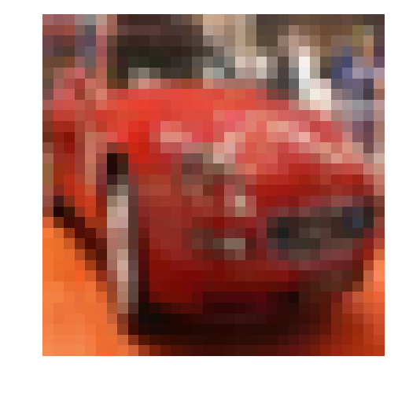

# Image Classification
In this project, you'll classify images from the [CIFAR-10 dataset](https://www.cs.toronto.edu/~kriz/cifar.html).  The dataset consists of airplanes, dogs, cats, and other objects. You'll preprocess the images, then train a convolutional neural network on all the samples. The images need to be normalized and the labels need to be one-hot encoded.  You'll get to apply what you learned and build a convolutional, max pooling, dropout, and fully connected layers.  At the end, you'll get to see your neural network's predictions on the sample images.
## Get the Data
Run the following cell to download the [CIFAR-10 dataset for python](https://www.cs.toronto.edu/~kriz/cifar-10-python.tar.gz).


```python
"""
DON'T MODIFY ANYTHING IN THIS CELL THAT IS BELOW THIS LINE
"""
from urllib.request import urlretrieve
from os.path import isfile, isdir
from tqdm import tqdm
import problem_unittests as tests
import tarfile

cifar10_dataset_folder_path = 'cifar-10-batches-py'

# Use Floyd's cifar-10 dataset if present
floyd_cifar10_location = '/cifar/cifar-10-python.tar.gz'
if isfile(floyd_cifar10_location):
    tar_gz_path = floyd_cifar10_location
else:
    tar_gz_path = 'cifar-10-python.tar.gz'

class DLProgress(tqdm):
    last_block = 0

    def hook(self, block_num=1, block_size=1, total_size=None):
        self.total = total_size
        self.update((block_num - self.last_block) * block_size)
        self.last_block = block_num

if not isfile(tar_gz_path):
    with DLProgress(unit='B', unit_scale=True, miniters=1, desc='CIFAR-10 Dataset') as pbar:
        urlretrieve(
            'https://www.cs.toronto.edu/~kriz/cifar-10-python.tar.gz',
            tar_gz_path,
            pbar.hook)

if not isdir(cifar10_dataset_folder_path):
    with tarfile.open(tar_gz_path) as tar:
        tar.extractall()
        tar.close()


tests.test_folder_path(cifar10_dataset_folder_path)
```

    All files found!


## Explore the Data
The dataset is broken into batches to prevent your machine from running out of memory.  The CIFAR-10 dataset consists of 5 batches, named `data_batch_1`, `data_batch_2`, etc.. Each batch contains the labels and images that are one of the following:
* airplane
* automobile
* bird
* cat
* deer
* dog
* frog
* horse
* ship
* truck

Understanding a dataset is part of making predictions on the data.  Play around with the code cell below by changing the `batch_id` and `sample_id`. The `batch_id` is the id for a batch (1-5). The `sample_id` is the id for a image and label pair in the batch.

Ask yourself "What are all possible labels?", "What is the range of values for the image data?", "Are the labels in order or random?".  Answers to questions like these will help you preprocess the data and end up with better predictions.


```python
%matplotlib inline
%config InlineBackend.figure_format = 'retina'

import helper
import numpy as np

# Explore the dataset
batch_id = 1
sample_id = 5
helper.display_stats(cifar10_dataset_folder_path, batch_id, sample_id)
```

    
    Stats of batch 1:
    Samples: 10000
    Label Counts: {0: 1005, 1: 974, 2: 1032, 3: 1016, 4: 999, 5: 937, 6: 1030, 7: 1001, 8: 1025, 9: 981}
    First 20 Labels: [6, 9, 9, 4, 1, 1, 2, 7, 8, 3, 4, 7, 7, 2, 9, 9, 9, 3, 2, 6]
    
    Example of Image 5:
    Image - Min Value: 0 Max Value: 252
    Image - Shape: (32, 32, 3)
    Label - Label Id: 1 Name: automobile





## Implement Preprocess Functions
### Normalize
In the cell below, implement the `normalize` function to take in image data, `x`, and return it as a normalized Numpy array. The values should be in the range of 0 to 1, inclusive.  The return object should be the same shape as `x`.


	


```python
def normalize(x):
    """
    Normalize a list of sample image data in the range of 0 to 1
    : x: List of image data.  The image shape is (32, 32, 3)
    : return: Numpy array of normalize data
    """
    x_min = x.min(axis=(0, 1), keepdims=True)
    x_max = x.max(axis=(0, 1), keepdims=True)
    x_normalized =(x - x_min)/(x_max - x_min)
    return x_normalized


"""
DON'T MODIFY ANYTHING IN THIS CELL THAT IS BELOW THIS LINE
"""
tests.test_normalize(normalize)
```

    Tests Passed


### One-hot encode
Just like the previous code cell, you'll be implementing a function for preprocessing.  This time, you'll implement the `one_hot_encode` function. The input, `x`, are a list of labels.  Implement the function to return the list of labels as One-Hot encoded Numpy array.  The possible values for labels are 0 to 9. The one-hot encoding function should return the same encoding for each value between each call to `one_hot_encode`.  Make sure to save the map of encodings outside the function.

Hint: Don't reinvent the wheel.


```python
def one_hot_encode(x):
    """
    One hot encode a list of sample labels. Return a one-hot encoded vector for each label.
    : x: List of sample Labels
    : return: Numpy array of one-hot encoded labels
    """
    from sklearn.preprocessing import OneHotEncoder
    enc = OneHotEncoder()
    enc.fit(np.asarray(([list(range(10))])).T)
    return enc.transform(np.asarray([x]).T).toarray()


"""
DON'T MODIFY ANYTHING IN THIS CELL THAT IS BELOW THIS LINE
"""
tests.test_one_hot_encode(one_hot_encode)
```

    Tests Passed


### Randomize Data
As you saw from exploring the data above, the order of the samples are randomized.  It doesn't hurt to randomize it again, but you don't need to for this dataset.

## Preprocess all the data and save it
Running the code cell below will preprocess all the CIFAR-10 data and save it to file. The code below also uses 10% of the training data for validation.


```python
"""
DON'T MODIFY ANYTHING IN THIS CELL
"""
# Preprocess Training, Validation, and Testing Data
helper.preprocess_and_save_data(cifar10_dataset_folder_path, normalize, one_hot_encode)
```

# Check Point
This is your first checkpoint.  If you ever decide to come back to this notebook or have to restart the notebook, you can start from here.  The preprocessed data has been saved to disk.


```python
"""
DON'T MODIFY ANYTHING IN THIS CELL
"""
import pickle
import problem_unittests as tests
import helper

# Load the Preprocessed Validation data
valid_features, valid_labels = pickle.load(open('preprocess_validation.p', mode='rb'))
```

## Build the network
For the neural network, you'll build each layer into a function.  Most of the code you've seen has been outside of functions. To test your code more thoroughly, we require that you put each layer in a function.  This allows us to give you better feedback and test for simple mistakes using our unittests before you submit your project.

>**Note:** If you're finding it hard to dedicate enough time for this course each week, we've provided a small shortcut to this part of the project. In the next couple of problems, you'll have the option to use classes from the [TensorFlow Layers](https://www.tensorflow.org/api_docs/python/tf/layers) or [TensorFlow Layers (contrib)](https://www.tensorflow.org/api_guides/python/contrib.layers) packages to build each layer, except the layers you build in the "Convolutional and Max Pooling Layer" section.  TF Layers is similar to Keras's and TFLearn's abstraction to layers, so it's easy to pickup.

>However, if you would like to get the most out of this course, try to solve all the problems _without_ using anything from the TF Layers packages. You **can** still use classes from other packages that happen to have the same name as ones you find in TF Layers! For example, instead of using the TF Layers version of the `conv2d` class, [tf.layers.conv2d](https://www.tensorflow.org/api_docs/python/tf/layers/conv2d), you would want to use the TF Neural Network version of `conv2d`, [tf.nn.conv2d](https://www.tensorflow.org/api_docs/python/tf/nn/conv2d). 

Let's begin!

### Input
The neural network needs to read the image data, one-hot encoded labels, and dropout keep probability. Implement the following functions
* Implement `neural_net_image_input`
 * Return a [TF Placeholder](https://www.tensorflow.org/api_docs/python/tf/placeholder)
 * Set the shape using `image_shape` with batch size set to `None`.
 * Name the TensorFlow placeholder "x" using the TensorFlow `name` parameter in the [TF Placeholder](https://www.tensorflow.org/api_docs/python/tf/placeholder).
* Implement `neural_net_label_input`
 * Return a [TF Placeholder](https://www.tensorflow.org/api_docs/python/tf/placeholder)
 * Set the shape using `n_classes` with batch size set to `None`.
 * Name the TensorFlow placeholder "y" using the TensorFlow `name` parameter in the [TF Placeholder](https://www.tensorflow.org/api_docs/python/tf/placeholder).
* Implement `neural_net_keep_prob_input`
 * Return a [TF Placeholder](https://www.tensorflow.org/api_docs/python/tf/placeholder) for dropout keep probability.
 * Name the TensorFlow placeholder "keep_prob" using the TensorFlow `name` parameter in the [TF Placeholder](https://www.tensorflow.org/api_docs/python/tf/placeholder).

These names will be used at the end of the project to load your saved model.

Note: `None` for shapes in TensorFlow allow for a dynamic size.


```python
import tensorflow as tf

def neural_net_image_input(image_shape):
    """
    Return a Tensor for a batch of image input
    : image_shape: Shape of the images
    : return: Tensor for image input.
    """
    #Implement Function
       
    return tf.placeholder(tf.float32, shape=((None,) + image_shape), name='x')


def neural_net_label_input(n_classes):
    """
    Return a Tensor for a batch of label input
    : n_classes: Number of classes
    : return: Tensor for label input.
    """
    # Implement Function
    return tf.placeholder(tf.float32, shape=(None, n_classes), name='y')


def neural_net_keep_prob_input():
    """
    Return a Tensor for keep probability
    : return: Tensor for keep probability.
    """
    # Implement Function
    return  tf.placeholder(tf.float32, name='keep_prob')


"""
DON'T MODIFY ANYTHING IN THIS CELL THAT IS BELOW THIS LINE
"""
tf.reset_default_graph()
tests.test_nn_image_inputs(neural_net_image_input)
tests.test_nn_label_inputs(neural_net_label_input)
tests.test_nn_keep_prob_inputs(neural_net_keep_prob_input)
```

    Image Input Tests Passed.
    Label Input Tests Passed.
    Keep Prob Tests Passed.


### Convolution and Max Pooling Layer
Convolution layers have a lot of success with images. For this code cell, you should implement the function `conv2d_maxpool` to apply convolution then max pooling:
* Create the weight and bias using `conv_ksize`, `conv_num_outputs` and the shape of `x_tensor`.
* Apply a convolution to `x_tensor` using weight and `conv_strides`.
 * We recommend you use same padding, but you're welcome to use any padding.
* Add bias
* Add a nonlinear activation to the convolution.
* Apply Max Pooling using `pool_ksize` and `pool_strides`.
 * We recommend you use same padding, but you're welcome to use any padding.

**Note:** You **can't** use [TensorFlow Layers](https://www.tensorflow.org/api_docs/python/tf/layers) or [TensorFlow Layers (contrib)](https://www.tensorflow.org/api_guides/python/contrib.layers) for **this** layer, but you can still use TensorFlow's [Neural Network](https://www.tensorflow.org/api_docs/python/tf/nn) package. You may still use the shortcut option for all the **other** layers.


```python
def conv2d_maxpool(x_tensor, conv_num_outputs, conv_ksize, conv_strides, pool_ksize, pool_strides):
    """
    Apply convolution then max pooling to x_tensor
    :param x_tensor: TensorFlow Tensor
    :param conv_num_outputs: Number of outputs for the convolutional layer
    :param conv_ksize: kernal size 2-D Tuple for the convolutional layer
    :param conv_strides: Stride 2-D Tuple for convolution
    :param pool_ksize: kernal size 2-D Tuple for pool
    :param pool_strides: Stride 2-D Tuple for pool
    : return: A tensor that represents convolution and max pooling of x_tensor
    """
    # Implement Function
   
    weights_shape =  [conv_ksize[0], conv_ksize[1], int(x_tensor.get_shape()[3]), conv_num_outputs]
    weights = tf.Variable(tf.truncated_normal(weights_shape, stddev=5e-2))
    bias = tf.Variable(tf.zeros(conv_num_outputs))
    conv = tf.nn.conv2d(x_tensor, weights, [1, conv_strides[0], conv_strides[1], 1], padding='SAME', name='conv')


    pre_activation = tf.nn.bias_add(conv, bias)
    conv1 = tf.nn.relu(pre_activation, name='conv1')
    pool1 = tf.nn.max_pool(conv1, [1, pool_ksize[0], pool_ksize[1], 1], [1, pool_strides[0],
                                                                         pool_strides[1], 1], padding='SAME', name='pool1')

    
    return pool1 


"""
DON'T MODIFY ANYTHING IN THIS CELL THAT IS BELOW THIS LINE
"""
tests.test_con_pool(conv2d_maxpool)
```

    Tests Passed


### Flatten Layer
Implement the `flatten` function to change the dimension of `x_tensor` from a 4-D tensor to a 2-D tensor.  The output should be the shape (*Batch Size*, *Flattened Image Size*). Shortcut option: you can use classes from the [TensorFlow Layers](https://www.tensorflow.org/api_docs/python/tf/layers) or [TensorFlow Layers (contrib)](https://www.tensorflow.org/api_guides/python/contrib.layers) packages for this layer. For more of a challenge, only use other TensorFlow packages.


```python
def flatten(x_tensor):
    """
    Flatten x_tensor to (Batch Size, Flattened Image Size)
    : x_tensor: A tensor of size (Batch Size, ...), where ... are the image dimensions.
    : return: A tensor of size (Batch Size, Flattened Image Size).
    """

    fs = np.array(x_tensor.get_shape().as_list()[1:]).prod()
    
    return tf.reshape(x_tensor, [tf.shape(x_tensor)[0], fs])


"""
DON'T MODIFY ANYTHING IN THIS CELL THAT IS BELOW THIS LINE
"""
tests.test_flatten(flatten)
```

    Tests Passed


### Fully-Connected Layer
Implement the `fully_conn` function to apply a fully connected layer to `x_tensor` with the shape (*Batch Size*, *num_outputs*). Shortcut option: you can use classes from the [TensorFlow Layers](https://www.tensorflow.org/api_docs/python/tf/layers) or [TensorFlow Layers (contrib)](https://www.tensorflow.org/api_guides/python/contrib.layers) packages for this layer. For more of a challenge, only use other TensorFlow packages.


```python
def fully_conn(x_tensor, num_outputs):
    """
    Apply a fully connected layer to x_tensor using weight and bias
    : x_tensor: A 2-D tensor where the first dimension is batch size.
    : num_outputs: The number of output that the new tensor should be.
    : return: A 2-D tensor where the second dimension is num_outputs.
    """

    fs = np.array(x_tensor.get_shape().as_list()[1:]).prod()
    bias = tf.Variable(tf.zeros(num_outputs))

    weights = tf.Variable(tf.truncated_normal([fs, num_outputs], stddev=5e-2))
    fc = tf.nn.relu(tf.matmul(x_tensor, weights) + bias, name='FC')
    
    return fc


"""
DON'T MODIFY ANYTHING IN THIS CELL THAT IS BELOW THIS LINE
"""
tests.test_fully_conn(fully_conn)
```

    Tests Passed


### Output Layer
Implement the `output` function to apply a fully connected layer to `x_tensor` with the shape (*Batch Size*, *num_outputs*). Shortcut option: you can use classes from the [TensorFlow Layers](https://www.tensorflow.org/api_docs/python/tf/layers) or [TensorFlow Layers (contrib)](https://www.tensorflow.org/api_guides/python/contrib.layers) packages for this layer. For more of a challenge, only use other TensorFlow packages.

**Note:** Activation, softmax, or cross entropy should **not** be applied to this.


```python
def output(x_tensor, num_outputs):
    """
    Apply a output layer to x_tensor using weight and bias
    : x_tensor: A 2-D tensor where the first dimension is batch size.
    : num_outputs: The number of output that the new tensor should be.
    : return: A 2-D tensor where the second dimension is num_outputs.
    """
    fs = np.array(x_tensor.get_shape().as_list()[1:]).prod()
    bias = tf.Variable(tf.zeros(num_outputs))

    weights = tf.Variable(tf.truncated_normal([fs, num_outputs], stddev=5e-2))
    output = tf.nn.relu(tf.matmul(x_tensor, weights) + bias, name='output')
    return output


"""
DON'T MODIFY ANYTHING IN THIS CELL THAT IS BELOW THIS LINE
"""
tests.test_output(output)
```

    Tests Passed


### Create Convolutional Model
Implement the function `conv_net` to create a convolutional neural network model. The function takes in a batch of images, `x`, and outputs logits.  Use the layers you created above to create this model:

* Apply 1, 2, or 3 Convolution and Max Pool layers
* Apply a Flatten Layer
* Apply 1, 2, or 3 Fully Connected Layers
* Apply an Output Layer
* Return the output
* Apply [TensorFlow's Dropout](https://www.tensorflow.org/api_docs/python/tf/nn/dropout) to one or more layers in the model using `keep_prob`. 


```python
def conv_net(x, keep_prob):
    """
    Create a convolutional neural network model
    : x: Placeholder tensor that holds image data.
    : keep_prob: Placeholder tensor that hold dropout keep probability.
    : return: Tensor that represents logits
    """
    # TODO: Apply 1, 2, or 3 Convolution and Max Pool layers
    #    Play around with different number of outputs, kernel size and stride
    # Function Definition from Above:
    conv = conv2d_maxpool(x,
                           conv_num_outputs=62,
                           conv_ksize=[6,6],
                           conv_strides=[2,2],
                           pool_ksize=[2,2],
                           pool_strides=[2,2])
    conv = conv2d_maxpool(conv,
                           conv_num_outputs=30,
                           conv_ksize=[3,3],
                           conv_strides=[1,1],
                           pool_ksize=[2,2],
                           pool_strides=[1,1])

    # Apply a Flatten Layer
    # Function Definition from Above:
    flatten_conv = flatten(conv)
    

    # TODO: Apply 1, 2, or 3 Fully Connected Layers
    #    Play around with different number of outputs
    # Function Definition from Above:
    fc =  fully_conn(flatten_conv, 200)
    fc =  fully_conn(flatten_conv, 100)
    fc =  fully_conn(fc, 10)
    
    dropout = tf.nn.dropout(fc, keep_prob)
    # TODO: Apply an Output Layer
    
    
    # TODO: return output
    return output(dropout, 10)  


"""
DON'T MODIFY ANYTHING IN THIS CELL THAT IS BELOW THIS LINE
"""

##############################
## Build the Neural Network ##
##############################

# Remove previous weights, bias, inputs, etc..
tf.reset_default_graph()

# Inputs
x = neural_net_image_input((32, 32, 3))
y = neural_net_label_input(10)
keep_prob = neural_net_keep_prob_input()

# Model
logits = conv_net(x, keep_prob)

# Name logits Tensor, so that is can be loaded from disk after training
logits = tf.identity(logits, name='logits')

# Loss and Optimizer
cost = tf.reduce_mean(tf.nn.softmax_cross_entropy_with_logits(logits=logits, labels=y))
optimizer = tf.train.AdamOptimizer().minimize(cost)

# Accuracy
correct_pred = tf.equal(tf.argmax(logits, 1), tf.argmax(y, 1))
accuracy = tf.reduce_mean(tf.cast(correct_pred, tf.float32), name='accuracy')

tests.test_conv_net(conv_net)
```

    Neural Network Built!


## Train the Neural Network
### Single Optimization
Implement the function `train_neural_network` to do a single optimization.  The optimization should use `optimizer` to optimize in `session` with a `feed_dict` of the following:
* `x` for image input
* `y` for labels
* `keep_prob` for keep probability for dropout

This function will be called for each batch, so `tf.global_variables_initializer()` has already been called.

Note: Nothing needs to be returned. This function is only optimizing the neural network.


```python
def train_neural_network(session, optimizer, keep_probability, feature_batch, label_batch):
    """
    Optimize the session on a batch of images and labels
    : session: Current TensorFlow session
    : optimizer: TensorFlow optimizer function
    : keep_probability: keep probability
    : feature_batch: Batch of Numpy image data
    : label_batch: Batch of Numpy label data
    """
    # Implement Function
    session.run(optimizer, feed_dict={x: feature_batch,
                                      y: label_batch,
                                      keep_prob: keep_probability})


"""
DON'T MODIFY ANYTHING IN THIS CELL THAT IS BELOW THIS LINE
"""
tests.test_train_nn(train_neural_network)
```

    Tests Passed


### Show Stats
Implement the function `print_stats` to print loss and validation accuracy.  Use the global variables `valid_features` and `valid_labels` to calculate validation accuracy.  Use a keep probability of `1.0` to calculate the loss and validation accuracy.


```python
def print_stats(session, feature_batch, label_batch, cost, accuracy):
    """
    Print information about loss and validation accuracy
    : session: Current TensorFlow session
    : feature_batch: Batch of Numpy image data
    : label_batch: Batch of Numpy label data
    : cost: TensorFlow cost function
    : accuracy: TensorFlow accuracy function
    """
    # Implement Function
    loss = sess.run(cost, feed_dict={x: feature_batch,
                                     y: label_batch,
                                     keep_prob: 1.})
    valid_acc = sess.run(accuracy, feed_dict={x: valid_features,
                                              y: valid_labels,
                                              keep_prob: 1.})
    print('Loss: {:>10.5f} Validation Accuracy: {:.5f}'.format(loss, valid_acc))
```

### Hyperparameters
Tune the following parameters:
* Set `epochs` to the number of iterations until the network stops learning or start overfitting
* Set `batch_size` to the highest number that your machine has memory for.  Most people set them to common sizes of memory:
 * 64
 * 128
 * 256
 * ...
* Set `keep_probability` to the probability of keeping a node using dropout


```python
# Tune Parameters
epochs = 99
batch_size = 256
keep_probability = 0.7
```

### Train on a Single CIFAR-10 Batch
Instead of training the neural network on all the CIFAR-10 batches of data, let's use a single batch. This should save time while you iterate on the model to get a better accuracy.  Once the final validation accuracy is 50% or greater, run the model on all the data in the next section.


```python
"""
DON'T MODIFY ANYTHING IN THIS CELL
"""
print('Checking the Training on a Single Batch...')
with tf.Session() as sess:
    # Initializing the variables
    sess.run(tf.global_variables_initializer())
    
    # Training cycle
    for epoch in range(epochs):
        batch_i = 1
        for batch_features, batch_labels in helper.load_preprocess_training_batch(batch_i, batch_size):
            train_neural_network(sess, optimizer, keep_probability, batch_features, batch_labels)
        print('Epoch {:>2}, CIFAR-10 Batch {}:  '.format(epoch + 1, batch_i), end='')
        print_stats(sess, batch_features, batch_labels, cost, accuracy)
```

    Checking the Training on a Single Batch...
    Epoch  1, CIFAR-10 Batch 1:  Loss:    2.22312 Validation Accuracy: 0.17020
    Epoch  2, CIFAR-10 Batch 1:  Loss:    2.16485 Validation Accuracy: 0.26040
    Epoch  3, CIFAR-10 Batch 1:  Loss:    2.13476 Validation Accuracy: 0.29620
    Epoch  4, CIFAR-10 Batch 1:  Loss:    2.07451 Validation Accuracy: 0.31560
    Epoch  5, CIFAR-10 Batch 1:  Loss:    2.03671 Validation Accuracy: 0.34840
    Epoch  6, CIFAR-10 Batch 1:  Loss:    2.06222 Validation Accuracy: 0.32900
    Epoch  7, CIFAR-10 Batch 1:  Loss:    1.98490 Validation Accuracy: 0.37060
    Epoch  8, CIFAR-10 Batch 1:  Loss:    1.91456 Validation Accuracy: 0.36340
    Epoch  9, CIFAR-10 Batch 1:  Loss:    1.83043 Validation Accuracy: 0.39460
    Epoch 10, CIFAR-10 Batch 1:  Loss:    1.75261 Validation Accuracy: 0.41080
    Epoch 11, CIFAR-10 Batch 1:  Loss:    1.70669 Validation Accuracy: 0.41420
    Epoch 12, CIFAR-10 Batch 1:  Loss:    1.71426 Validation Accuracy: 0.41100
    Epoch 13, CIFAR-10 Batch 1:  Loss:    1.60128 Validation Accuracy: 0.41260
    Epoch 14, CIFAR-10 Batch 1:  Loss:    1.55808 Validation Accuracy: 0.42760
    Epoch 15, CIFAR-10 Batch 1:  Loss:    1.56452 Validation Accuracy: 0.43560
    Epoch 16, CIFAR-10 Batch 1:  Loss:    1.48393 Validation Accuracy: 0.44540
    Epoch 17, CIFAR-10 Batch 1:  Loss:    1.47080 Validation Accuracy: 0.44920
    Epoch 18, CIFAR-10 Batch 1:  Loss:    1.45832 Validation Accuracy: 0.46140
    Epoch 19, CIFAR-10 Batch 1:  Loss:    1.44252 Validation Accuracy: 0.45840
    Epoch 20, CIFAR-10 Batch 1:  Loss:    1.36523 Validation Accuracy: 0.47100
    Epoch 21, CIFAR-10 Batch 1:  Loss:    1.34430 Validation Accuracy: 0.47640
    Epoch 22, CIFAR-10 Batch 1:  Loss:    1.36530 Validation Accuracy: 0.45880
    Epoch 23, CIFAR-10 Batch 1:  Loss:    1.31985 Validation Accuracy: 0.47160
    Epoch 24, CIFAR-10 Batch 1:  Loss:    1.25898 Validation Accuracy: 0.48220
    Epoch 25, CIFAR-10 Batch 1:  Loss:    1.30117 Validation Accuracy: 0.46940
    Epoch 26, CIFAR-10 Batch 1:  Loss:    1.20575 Validation Accuracy: 0.50360
    Epoch 27, CIFAR-10 Batch 1:  Loss:    1.24581 Validation Accuracy: 0.48360
    Epoch 28, CIFAR-10 Batch 1:  Loss:    1.17947 Validation Accuracy: 0.50520
    Epoch 29, CIFAR-10 Batch 1:  Loss:    1.18079 Validation Accuracy: 0.49520
    Epoch 30, CIFAR-10 Batch 1:  Loss:    1.17487 Validation Accuracy: 0.49280
    Epoch 31, CIFAR-10 Batch 1:  Loss:    1.14160 Validation Accuracy: 0.51420
    Epoch 32, CIFAR-10 Batch 1:  Loss:    1.09016 Validation Accuracy: 0.51200
    Epoch 33, CIFAR-10 Batch 1:  Loss:    1.08376 Validation Accuracy: 0.50220
    Epoch 34, CIFAR-10 Batch 1:  Loss:    1.04542 Validation Accuracy: 0.51880
    Epoch 35, CIFAR-10 Batch 1:  Loss:    1.04269 Validation Accuracy: 0.52820
    Epoch 36, CIFAR-10 Batch 1:  Loss:    1.00331 Validation Accuracy: 0.52480
    Epoch 37, CIFAR-10 Batch 1:  Loss:    1.00294 Validation Accuracy: 0.52320
    Epoch 38, CIFAR-10 Batch 1:  Loss:    0.96014 Validation Accuracy: 0.52820
    Epoch 39, CIFAR-10 Batch 1:  Loss:    0.93832 Validation Accuracy: 0.52380
    Epoch 40, CIFAR-10 Batch 1:  Loss:    0.91907 Validation Accuracy: 0.52620
    Epoch 41, CIFAR-10 Batch 1:  Loss:    0.92318 Validation Accuracy: 0.51640
    Epoch 42, CIFAR-10 Batch 1:  Loss:    0.90152 Validation Accuracy: 0.52280
    Epoch 43, CIFAR-10 Batch 1:  Loss:    0.88979 Validation Accuracy: 0.53280
    Epoch 44, CIFAR-10 Batch 1:  Loss:    0.86883 Validation Accuracy: 0.52060
    Epoch 45, CIFAR-10 Batch 1:  Loss:    0.79593 Validation Accuracy: 0.54000
    Epoch 46, CIFAR-10 Batch 1:  Loss:    0.77510 Validation Accuracy: 0.54000
    Epoch 47, CIFAR-10 Batch 1:  Loss:    0.81125 Validation Accuracy: 0.53220
    Epoch 48, CIFAR-10 Batch 1:  Loss:    0.80047 Validation Accuracy: 0.52680
    Epoch 49, CIFAR-10 Batch 1:  Loss:    0.72984 Validation Accuracy: 0.53480
    Epoch 50, CIFAR-10 Batch 1:  Loss:    0.71339 Validation Accuracy: 0.53440
    Epoch 51, CIFAR-10 Batch 1:  Loss:    0.67346 Validation Accuracy: 0.54740
    Epoch 52, CIFAR-10 Batch 1:  Loss:    0.66574 Validation Accuracy: 0.54580
    Epoch 53, CIFAR-10 Batch 1:  Loss:    0.66242 Validation Accuracy: 0.52240
    Epoch 54, CIFAR-10 Batch 1:  Loss:    0.62895 Validation Accuracy: 0.52840
    Epoch 55, CIFAR-10 Batch 1:  Loss:    0.59265 Validation Accuracy: 0.53540
    Epoch 56, CIFAR-10 Batch 1:  Loss:    0.62346 Validation Accuracy: 0.52520
    Epoch 57, CIFAR-10 Batch 1:  Loss:    0.59959 Validation Accuracy: 0.54380
    Epoch 58, CIFAR-10 Batch 1:  Loss:    0.65179 Validation Accuracy: 0.53820
    Epoch 59, CIFAR-10 Batch 1:  Loss:    0.59043 Validation Accuracy: 0.54860
    Epoch 60, CIFAR-10 Batch 1:  Loss:    0.59095 Validation Accuracy: 0.53940
    Epoch 61, CIFAR-10 Batch 1:  Loss:    0.59764 Validation Accuracy: 0.51860
    Epoch 62, CIFAR-10 Batch 1:  Loss:    0.59760 Validation Accuracy: 0.51220
    Epoch 63, CIFAR-10 Batch 1:  Loss:    0.57819 Validation Accuracy: 0.52420
    Epoch 64, CIFAR-10 Batch 1:  Loss:    0.50594 Validation Accuracy: 0.53400
    Epoch 65, CIFAR-10 Batch 1:  Loss:    0.49217 Validation Accuracy: 0.54160
    Epoch 66, CIFAR-10 Batch 1:  Loss:    0.47473 Validation Accuracy: 0.53380
    Epoch 67, CIFAR-10 Batch 1:  Loss:    0.49251 Validation Accuracy: 0.53920
    Epoch 68, CIFAR-10 Batch 1:  Loss:    0.44447 Validation Accuracy: 0.53260
    Epoch 69, CIFAR-10 Batch 1:  Loss:    0.46185 Validation Accuracy: 0.52400
    Epoch 70, CIFAR-10 Batch 1:  Loss:    0.46265 Validation Accuracy: 0.54580
    Epoch 71, CIFAR-10 Batch 1:  Loss:    0.45692 Validation Accuracy: 0.55040
    Epoch 72, CIFAR-10 Batch 1:  Loss:    0.42216 Validation Accuracy: 0.55540
    Epoch 73, CIFAR-10 Batch 1:  Loss:    0.40830 Validation Accuracy: 0.55780
    Epoch 74, CIFAR-10 Batch 1:  Loss:    0.40708 Validation Accuracy: 0.55840
    Epoch 75, CIFAR-10 Batch 1:  Loss:    0.40970 Validation Accuracy: 0.54100
    Epoch 76, CIFAR-10 Batch 1:  Loss:    0.40893 Validation Accuracy: 0.54400
    Epoch 77, CIFAR-10 Batch 1:  Loss:    0.40514 Validation Accuracy: 0.54060
    Epoch 78, CIFAR-10 Batch 1:  Loss:    0.40358 Validation Accuracy: 0.55220
    Epoch 79, CIFAR-10 Batch 1:  Loss:    0.41101 Validation Accuracy: 0.54340
    Epoch 80, CIFAR-10 Batch 1:  Loss:    0.39550 Validation Accuracy: 0.54880
    Epoch 81, CIFAR-10 Batch 1:  Loss:    0.35332 Validation Accuracy: 0.55600
    Epoch 82, CIFAR-10 Batch 1:  Loss:    0.33676 Validation Accuracy: 0.55820
    Epoch 83, CIFAR-10 Batch 1:  Loss:    0.36678 Validation Accuracy: 0.55140
    Epoch 84, CIFAR-10 Batch 1:  Loss:    0.35224 Validation Accuracy: 0.55260
    Epoch 85, CIFAR-10 Batch 1:  Loss:    0.38769 Validation Accuracy: 0.53880
    Epoch 86, CIFAR-10 Batch 1:  Loss:    0.34884 Validation Accuracy: 0.53800
    Epoch 87, CIFAR-10 Batch 1:  Loss:    0.33404 Validation Accuracy: 0.54360
    Epoch 88, CIFAR-10 Batch 1:  Loss:    0.33230 Validation Accuracy: 0.54240
    Epoch 89, CIFAR-10 Batch 1:  Loss:    0.34164 Validation Accuracy: 0.54400
    Epoch 90, CIFAR-10 Batch 1:  Loss:    0.35066 Validation Accuracy: 0.54220
    Epoch 91, CIFAR-10 Batch 1:  Loss:    0.34214 Validation Accuracy: 0.55820
    Epoch 92, CIFAR-10 Batch 1:  Loss:    0.34903 Validation Accuracy: 0.55560
    Epoch 93, CIFAR-10 Batch 1:  Loss:    0.32838 Validation Accuracy: 0.55100
    Epoch 94, CIFAR-10 Batch 1:  Loss:    0.32027 Validation Accuracy: 0.56000
    Epoch 95, CIFAR-10 Batch 1:  Loss:    0.30013 Validation Accuracy: 0.55800
    Epoch 96, CIFAR-10 Batch 1:  Loss:    0.31973 Validation Accuracy: 0.55340
    Epoch 97, CIFAR-10 Batch 1:  Loss:    0.28696 Validation Accuracy: 0.55140
    Epoch 98, CIFAR-10 Batch 1:  Loss:    0.29047 Validation Accuracy: 0.54020
    Epoch 99, CIFAR-10 Batch 1:  Loss:    0.27166 Validation Accuracy: 0.53620


### Fully Train the Model
Now that you got a good accuracy with a single CIFAR-10 batch, try it with all five batches.


```python
"""
DON'T MODIFY ANYTHING IN THIS CELL
"""
save_model_path = './image_classification'

print('Training...')
with tf.Session() as sess:
    # Initializing the variables
    sess.run(tf.global_variables_initializer())
    
    # Training cycle
    for epoch in range(epochs):
        # Loop over all batches
        n_batches = 5
        for batch_i in range(1, n_batches + 1):
            for batch_features, batch_labels in helper.load_preprocess_training_batch(batch_i, batch_size):
                train_neural_network(sess, optimizer, keep_probability, batch_features, batch_labels)
            print('Epoch {:>2}, CIFAR-10 Batch {}:  '.format(epoch + 1, batch_i), end='')
            print_stats(sess, batch_features, batch_labels, cost, accuracy)
            
    # Save Model
    saver = tf.train.Saver()
    save_path = saver.save(sess, save_model_path)
```

    Training...


# Checkpoint
The model has been saved to disk.
## Test Model
Test your model against the test dataset.  This will be your final accuracy. You should have an accuracy greater than 50%. If you don't, keep tweaking the model architecture and parameters.


```python
"""
DON'T MODIFY ANYTHING IN THIS CELL
"""
%matplotlib inline
%config InlineBackend.figure_format = 'retina'

import tensorflow as tf
import pickle
import helper
import random

# Set batch size if not already set
try:
    if batch_size:
        pass
except NameError:
    batch_size = 64

save_model_path = './image_classification'
n_samples = 4
top_n_predictions = 3

def test_model():
    """
    Test the saved model against the test dataset
    """

    test_features, test_labels = pickle.load(open('preprocess_test.p', mode='rb'))
    loaded_graph = tf.Graph()

    with tf.Session(graph=loaded_graph) as sess:
        # Load model
        loader = tf.train.import_meta_graph(save_model_path + '.meta')
        loader.restore(sess, save_model_path)

        # Get Tensors from loaded model
        loaded_x = loaded_graph.get_tensor_by_name('x:0')
        loaded_y = loaded_graph.get_tensor_by_name('y:0')
        loaded_keep_prob = loaded_graph.get_tensor_by_name('keep_prob:0')
        loaded_logits = loaded_graph.get_tensor_by_name('logits:0')
        loaded_acc = loaded_graph.get_tensor_by_name('accuracy:0')
        
        # Get accuracy in batches for memory limitations
        test_batch_acc_total = 0
        test_batch_count = 0
        
        for test_feature_batch, test_label_batch in helper.batch_features_labels(test_features, test_labels, batch_size):
            test_batch_acc_total += sess.run(
                loaded_acc,
                feed_dict={loaded_x: test_feature_batch, loaded_y: test_label_batch, loaded_keep_prob: 1.0})
            test_batch_count += 1

        print('Testing Accuracy: {}\n'.format(test_batch_acc_total/test_batch_count))

        # Print Random Samples
        random_test_features, random_test_labels = tuple(zip(*random.sample(list(zip(test_features, test_labels)), n_samples)))
        random_test_predictions = sess.run(
            tf.nn.top_k(tf.nn.softmax(loaded_logits), top_n_predictions),
            feed_dict={loaded_x: random_test_features, loaded_y: random_test_labels, loaded_keep_prob: 1.0})
        helper.display_image_predictions(random_test_features, random_test_labels, random_test_predictions)


test_model()
```

## Why 50-80% Accuracy?
You might be wondering why you can't get an accuracy any higher. First things first, 50% isn't bad for a simple CNN.  Pure guessing would get you 10% accuracy. However, you might notice people are getting scores [well above 80%](http://rodrigob.github.io/are_we_there_yet/build/classification_datasets_results.html#43494641522d3130).  That's because we haven't taught you all there is to know about neural networks. We still need to cover a few more techniques.
## Submitting This Project
When submitting this project, make sure to run all the cells before saving the notebook.  Save the notebook file as "dlnd_image_classification.ipynb" and save it as a HTML file under "File" -> "Download as".  Include the "helper.py" and "problem_unittests.py" files in your submission.
